# Raport

# Przetwarzanie i analiza danych przestrzennych 
# Oracle spatial


---

**Imiona i nazwiska: Judyta Bąkowska, Karolina Źróbek**

--- 

Celem ćwiczenia jest zapoznanie się ze sposobem przechowywania, przetwarzania i analizy danych przestrzennych w bazach danych
(na przykładzie systemu Oracle spatial)

Swoje odpowiedzi wpisuj w miejsca oznaczone jako:

---
> Wyniki, zrzut ekranu, komentarz

```sql
--  ...
```

---

Do wykonania ćwiczenia (zadania 1 – 7) i wizualizacji danych wykorzystaj Oracle SQL Develper. Alternatywnie możesz wykonać analizy w środowisku Python/Jupyter Notebook

Do wykonania zadania 8 wykorzystaj środowisko Python/Jupyter Notebook

Raport należy przesłać w formacie pdf.

Należy też dołączyć raport zawierający kod w formacie źródłowym.

Np.
- plik tekstowy .sql z kodem poleceń
- plik .md zawierający kod wersji tekstowej
- notebook programu jupyter – plik .ipynb

Zamieść kod rozwiązania oraz zrzuty ekranu pokazujące wyniki, (dołącz kod rozwiązania w formie tekstowej/źródłowej)

Zwróć uwagę na formatowanie kodu

<div style="page-break-after: always;"></div>

# Zadanie 1

Zwizualizuj przykładowe dane

US_STATES


> Wyniki, zrzut ekranu, komentarz

```sql
--  ...
```


US_INTERSTATES


> Wyniki, zrzut ekranu, komentarz

```sql
--  ...
```


US_CITIES


> Wyniki, zrzut ekranu, komentarz

```sql
--  ...
```


US_RIVERS


> Wyniki, zrzut ekranu, komentarz

```sql
--  ...
```


US_COUNTIES


> Wyniki, zrzut ekranu, komentarz

```sql
--  ...
```


US_PARKS


> Wyniki, zrzut ekranu, komentarz

```sql
--  ...
```


# Zadanie 2

Znajdź wszystkie stany (us_states) których obszary mają część wspólną ze wskazaną geometrią (prostokątem)

Pokaż wynik na mapie.

prostokąt

```sql
SELECT  sdo_geometry (2003, 8307, null,
sdo_elem_info_array (1,1003,3),
sdo_ordinate_array ( -117.0, 40.0, -90., 44.0)) g
FROM dual
```


> Wyniki, zrzut ekranu, komentarz


 
Zaczniemy od zwizualizowania tego prostokąta: 

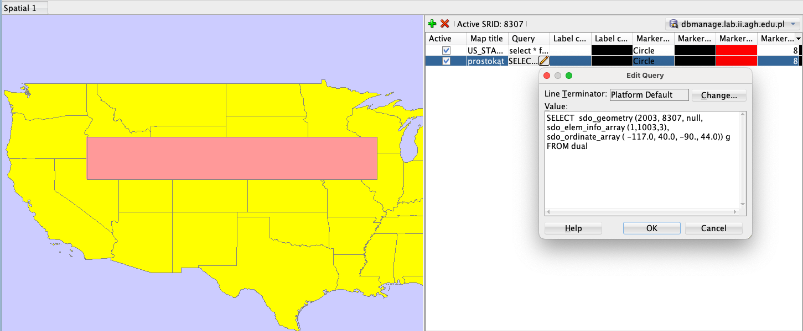


Użyj funkcji SDO_FILTER

```sql
SELECT state, geom FROM us_states
WHERE sdo_filter (geom,
sdo_geometry (2003, 8307, null,
sdo_elem_info_array (1,1003,3),
sdo_ordinate_array ( -117.0, 40.0, -90., 44.0))
) = 'TRUE';
```

Zwróć uwagę na liczbę zwróconych wierszy (16)


> Wyniki, zrzut ekranu, komentarz

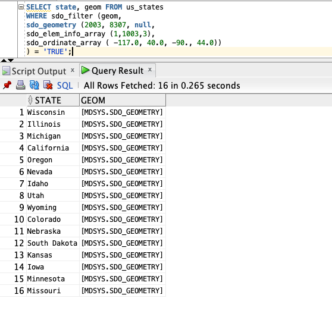

Zgadza się liczba 16 wierszy, zatrem zwizualizujmy to zapytanie

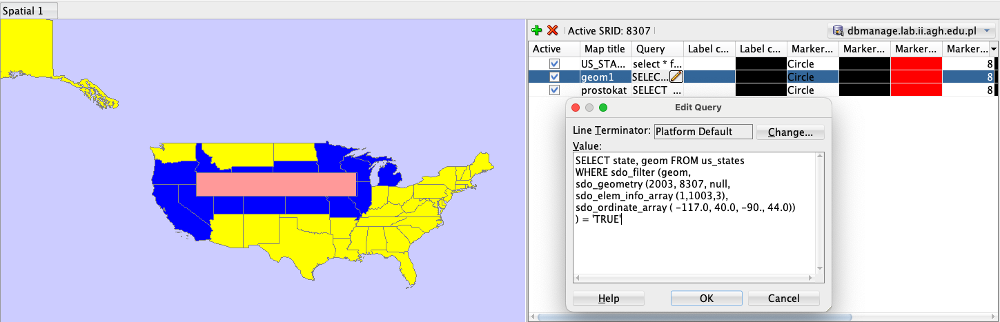
Widzimy, ze nie wszystkie stany mają częśc wspólną z prostokątem a mimo to są zakolorowane

Spróbujmy zatem zrobić to jeszcze raz, ale tym razem przy pomocy funkcji SDO_ANYINTERACT

Użyj funkcji  SDO_ANYINTERACT

```sql
SELECT state, geom FROM us_states
WHERE sdo_anyinteract (geom,
sdo_geometry (2003, 8307, null,
sdo_elem_info_array (1,1003,3),
sdo_ordinate_array ( -117.0, 40.0, -90., 44.0))
) = 'TRUE';
```

Porównaj wyniki sdo_filter i sdo_anyinteract

Pokaż wynik na mapie


> Wyniki, zrzut ekranu, komentarz

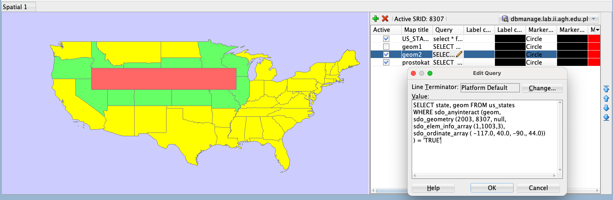

Funkcja SDO_ANYINTERACT okazała się być bardziej efektywna w tym przypadku, ponieważ dostarczyła wyniki zawierające jedynie te obszary, które faktycznie nakładają się na określony prostokąt w kontekście ich powierzchni. Dzięki temu, że jest ona bardziej precyzyjna, otrzymujemy wyniki, które są dokładniejsze i bardziej zgodne z oczekiwaniami.

Jak widać ponizej, zapytanie z uzyciem SDO_FILTER zwracało wiecej wyników:

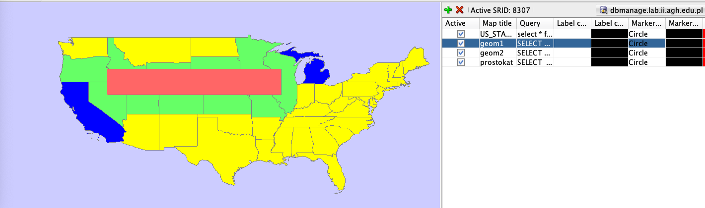

# Zadanie 3

Znajdź wszystkie parki (us_parks) których obszary znajdują się wewnątrz stanu Wyoming

Użyj funkcji SDO_INSIDE

```sql
SELECT p.name, p.geom
FROM us_parks p, us_states s
WHERE s.state = 'Wyoming'
AND SDO_INSIDE (p.geom, s.geom ) = 'TRUE';
```

W przypadku wykorzystywania narzędzia SQL Developer, w celu wizualizacji na mapie użyj podzapytania

```sql
SELECT pp.name, pp.geom  FROM us_parks pp
WHERE id IN
(
    SELECT p.id
    FROM us_parks p, us_states s
    WHERE s.state = 'Wyoming'
    and SDO_INSIDE (p.geom, s.geom ) = 'TRUE'
)
```


> Wyniki, zrzut ekranu, komentarz

```sql
--  ...
```


```sql
SELECT state, geom FROM us_states
WHERE state = 'Wyoming'
```


> Wyniki, zrzut ekranu, komentarz

```sql
--  ...
```


Porównaj wynik z:

```sql
SELECT p.name, p.geom
FROM us_parks p, us_states s
WHERE s.state = 'Wyoming'
AND SDO_ANYINTERACT (p.geom, s.geom ) = 'TRUE';
```

W celu wizualizacji użyj podzapytania


> Wyniki, zrzut ekranu, komentarz

```sql
--  ...
```


# Zadanie 4

Znajdź wszystkie jednostki administracyjne (us_counties) wewnątrz stanu New Hampshire

```sql
SELECT c.county, c.state_abrv, c.geom
FROM us_counties c, us_states s
WHERE s.state = 'New Hampshire'
AND SDO_RELATE ( c.geom,s.geom, 'mask=INSIDE+COVEREDBY') = 'TRUE';

SELECT c.county, c.state_abrv, c.geom
FROM us_counties c, us_states s
WHERE s.state = 'New Hampshire'
AND SDO_RELATE ( c.geom,s.geom, 'mask=INSIDE') = 'TRUE';

SELECT c.county, c.state_abrv, c.geom
FROM us_counties c, us_states s
WHERE s.state = 'New Hampshire'
AND SDO_RELATE ( c.geom,s.geom, 'mask=COVEREDBY') = 'TRUE';
```

W przypadku wykorzystywania narzędzia SQL Developer, w celu wizualizacji danych na mapie należy użyć podzapytania (podobnie jak w poprzednim zadaniu)


> Wyniki, zrzut ekranu, komentarz

1. Zacznijmy od uzycia pierwszego zapytania

```sql
SELECT c.county, c.state_abrv, c.geom
FROM us_counties c, us_states s
WHERE s.state = 'New Hampshire'
AND SDO_RELATE ( c.geom,s.geom, 'mask=INSIDE+COVEREDBY') = 'TRUE';
```
Wizualizacja tego obszaru wygląda tak:

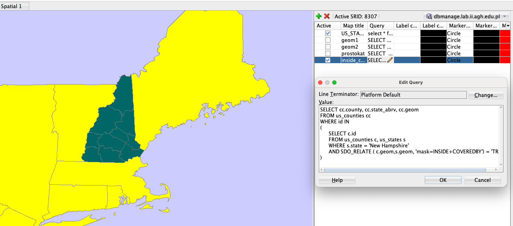

2. 'mask=INSIDE'

```sql
SELECT c.county, c.state_abrv, c.geom
FROM us_counties c, us_states s
WHERE s.state = 'New Hampshire'
AND SDO_RELATE ( c.geom,s.geom, 'mask=INSIDE') = 'TRUE';
```
Wizualizacja tego obszaru wygląda tak, jest to oczywiście ten rózowy fragment:

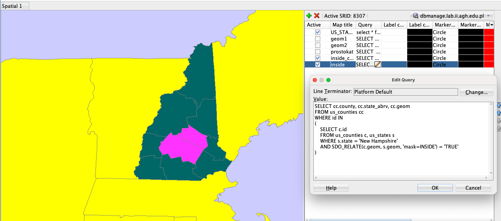

3. mask=COVEREDBY

```sql
SELECT c.county, c.state_abrv, c.geom
FROM us_counties c, us_states s
WHERE s.state = 'New Hampshire'
AND SDO_RELATE ( c.geom,s.geom, 'mask=COVEREDBY') = 'TRUE';
```
Wizualizacja:
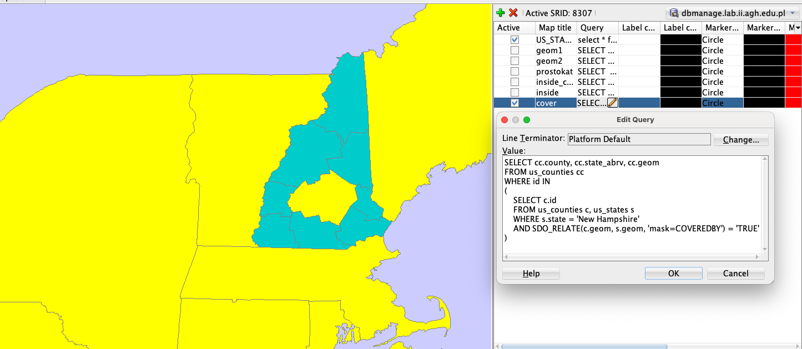


Zatem widzimy, ze wizualizując kazdą z tych rzeczy dostajemy inne informacje

> INSIDE+COVEREDBY -> 10 wyników, zwrócone zostały hrabstwa, które są całkowicie wewnątrz New Hampshire lub są pokryte przez ten stan.

> INSIDE -> 2 wyniki, hrabstwa, które znajdują się całkowicie wewnątrz stanu New Hampshire.

> COVEREDBY -> 8 wyników, hrabstwa pokryte, czyli te wewnątrz, mające wspólną granicę z New Hampshire.


# Zadanie 5

Znajdź wszystkie miasta w odległości 50 mili od drogi (us_interstates) I4

Pokaż wyniki na mapie

```sql
SELECT * FROM us_interstates
WHERE interstate = 'I4'

SELECT * FROM us_states
WHERE state_abrv = 'FL'

SELECT c.city, c.state_abrv, c.location 
FROM us_cities c
WHERE ROWID IN 
( 
SELECT c.rowid
FROM us_interstates i, us_cities c 
WHERE i.interstate = 'I4'
AND sdo_within_distance (c.location, i.geom,'distance=50 unit=mile' ='TRUE'
)
```


> Wyniki, zrzut ekranu, komentarz

Miasta znajdujące się 50 mil od l4:
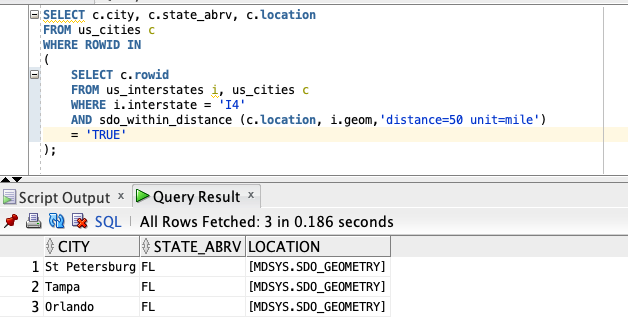

Wizualizacja:
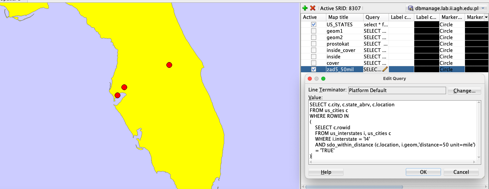


Dodatkowo:

a)     Znajdz wszystkie jednostki administracyjne przez które przechodzi droga I4

```sql
SELECT c.COUNTY, c.GEOM
FROM us_counties c
WHERE SDO_ANYINTERACT(c.GEOM, (SELECT i.GEOM FROM us_interstates i WHERE i.INTERSTATE = 'I4')) = 'TRUE'
```
Wizualizacja:
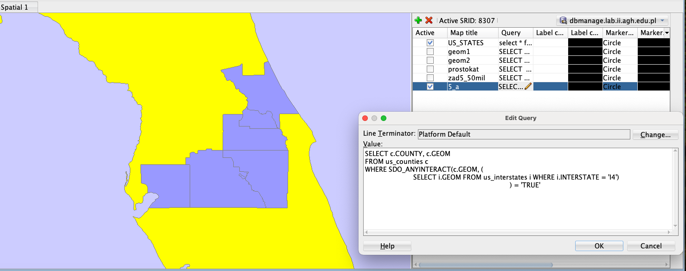


b)    Znajdz wszystkie jednostki administracyjne w pewnej odległości od I4

```sql
SELECT c.COUNTY, c.STATE_ABRV, c.GEOM
FROM us_counties c
WHERE SDO_WITHIN_DISTANCE(c.GEOM, (SELECT i.GEOM FROM us_interstates i WHERE i.INTERSTATE = 'I4'), 'distance=30 unit=mile') = 'TRUE';
```

Wizualizacja:
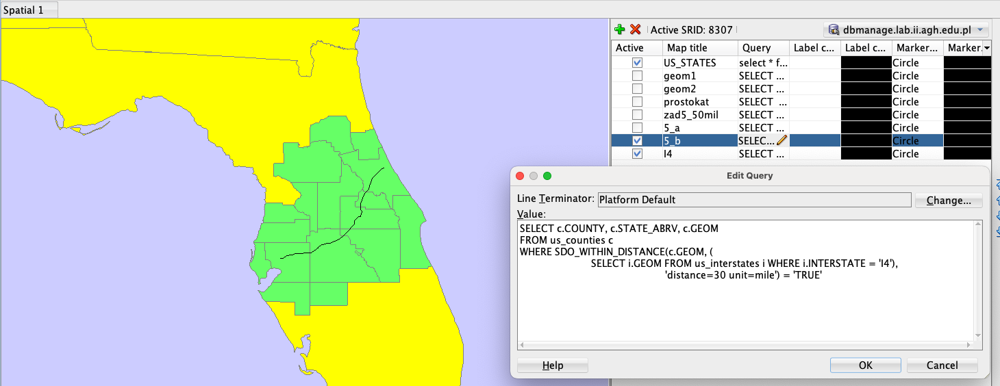

c)     Znajdz rzeki które przecina droga I4

```sql
SELECT r.NAME, r.GEOM
FROM us_rivers r
WHERE SDO_ANYINTERACT(r.GEOM, (SELECT i.GEOM FROM us_interstates i WHERE i.INTERSTATE = 'I4')) = 'TRUE';
```
Wizualizacja:
Rzeka jest ta idąca z góry na dół
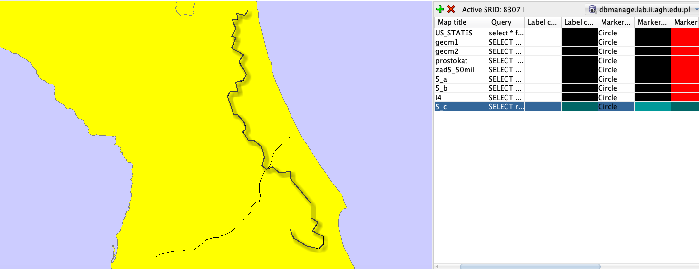

d)    Znajdz wszystkie drogi które przecinają rzekę Mississippi

```sql
SELECT i.INTERSTATE, i.GEOM
FROM us_interstates i
WHERE SDO_ANYINTERACT(i.GEOM, (SELECT r.GEOM FROM us_rivers r WHERE r.NAME = 'Mississippi')) = 'TRUE';
```
Wizualizacja:
Rzeka Mississippi jest ta idąca z góry na dół
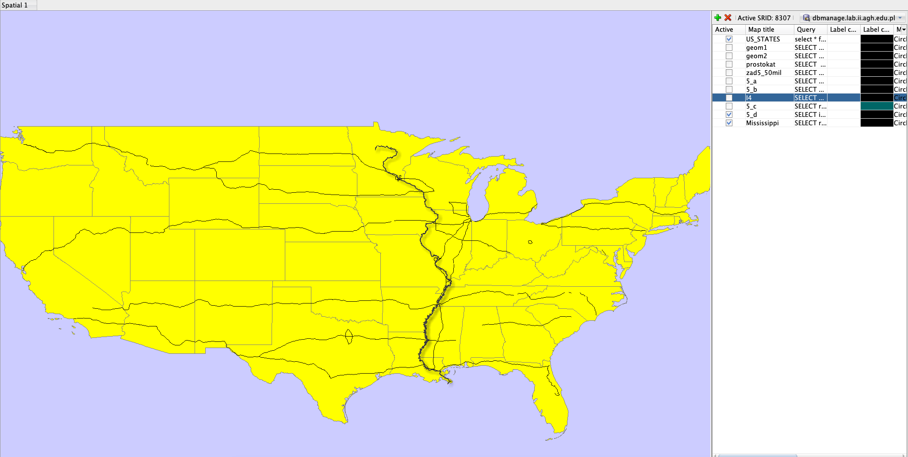

e)    Znajdz wszystkie miasta w odlegości od 15 do 30 mil od drogi 'I275'

Mimo, ze ponizszy kod wydaje się logiczny niestety nie wyświetla zadnych wyników
```sql

SELECT c.city, c.state_abrv, 
       SDO_UTIL.TO_WKTGEOMETRY(c.location) AS city_geometry, 
       SDO_GEOM.SDO_DISTANCE(c.location, i.geom, 0.005) AS distance
FROM us_cities c, us_interstates i
WHERE i.interstate = 'I275'
AND SDO_GEOM.SDO_DISTANCE(c.location, i.geom, 0.005) BETWEEN (15 * 1609.34) AND (30 * 1609.34);
```

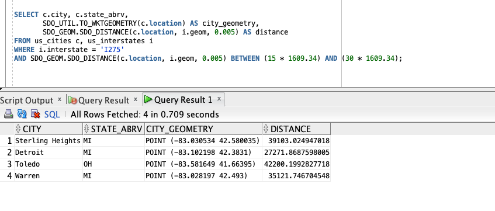

Wizualizacja:
 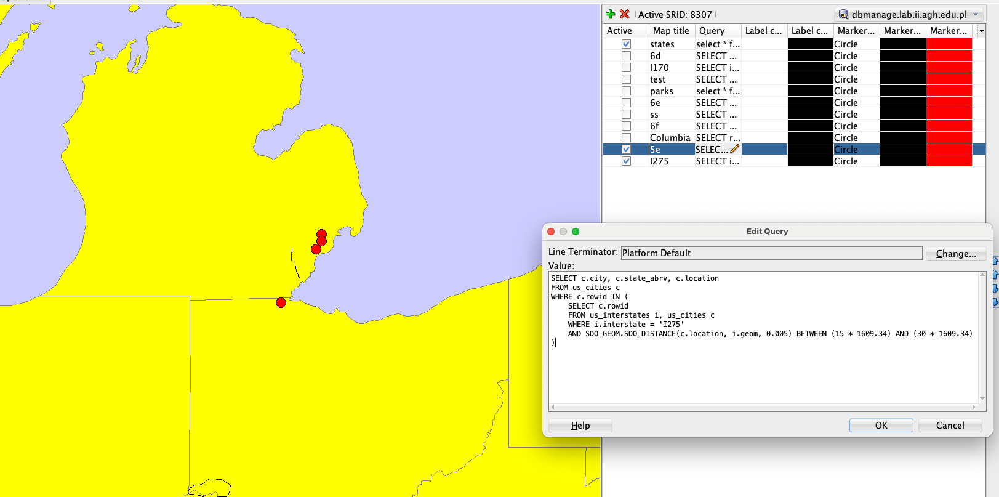


f)      Itp. (własne przykłady)


 Znajdz wszystkie  jednostki administracyjne (us_counties) przez które przepływa rzeka Columbia:

 ```sql
SELECT s.COUNTY, s.GEOM FROM us_counties s WHERE SDO_ANYINTERACT(s.GEOM, (SELECT r.GEOM FROM us_rivers r WHERE r.NAME = 'Columbia')) = 'TRUE'
 ```

 Wizualizacja:
 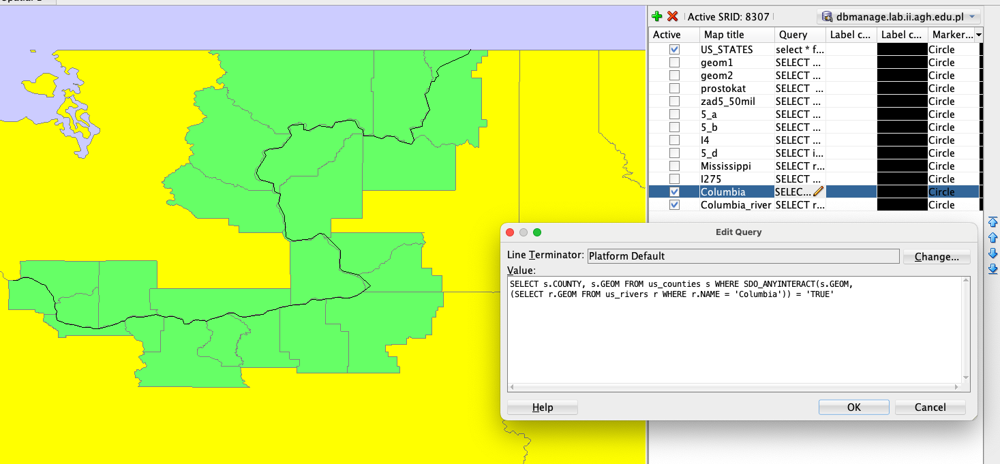


# Zadanie 6

Znajdz 5 miast najbliższych drogi I4

```sql
SELECT c.city, c.state_abrv, c.location
FROM us_interstates i, us_cities c 
WHERE i.interstate = 'I4'
AND sdo_nn(c.location, i.geom, 'sdo_num_res=5') = 'TRUE';
```

>Wyniki, zrzut ekranu, komentarz

Wizualizacja drogi I4:
```sql
SELECT i.geom
FROM us_interstates i
WHERE i.interstate = 'I4'
```
Aby zwizualizowac: Znajdz 5 miast najbliższych drogi I4:

```sql
SELECT c.city, c.state_abrv, c.location
FROM us_cities c
WHERE c.rowid IN (
    SELECT c.rowid
    FROM us_interstates i, us_cities c
    WHERE i.interstate = 'I4'
    AND sdo_nn(c.location, i.geom, 'sdo_num_res=5') = 'TRUE')
```
 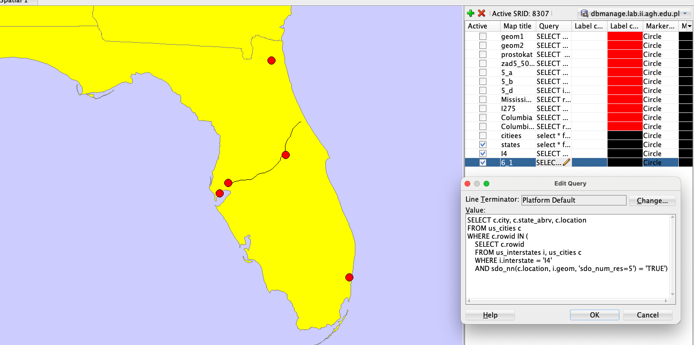


Dodatkowo:

a)     Znajdz kilka miast najbliższych rzece Mississippi

```sql
SELECT c.city, c.state_abrv, c.location
FROM us_cities c
WHERE c.rowid IN (
    SELECT c.rowid
    from us_rivers r
    WHERE r.name = 'Mississippi'
    AND sdo_nn(c.location, r.geom, 'sdo_num_res=6') = 'TRUE'
)
```
Wizualizacja:
 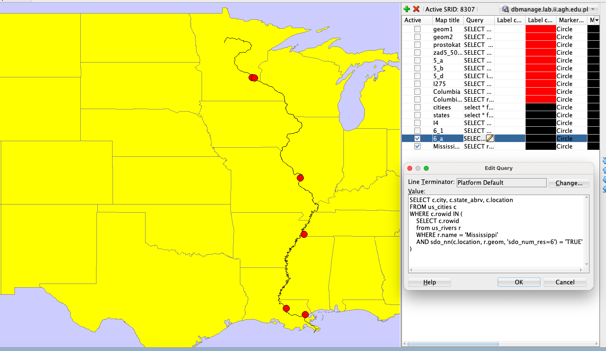

b)    Znajdz 3 miasta najbliżej Nowego Jorku

```sql
SELECT c.city, c.state_abrv, c.location
FROM us_cities c
WHERE c.rowid IN (
    SELECT c.rowid
    FROM us_cities ny, us_cities c
    WHERE ny.city = 'New York'
    AND c.city != 'New York'
    AND sdo_nn(c.location, ny.location, 'sdo_num_res=4') = 'TRUE'
)
```

Wizualizacja (na niebiesko zaznaczony New York):
 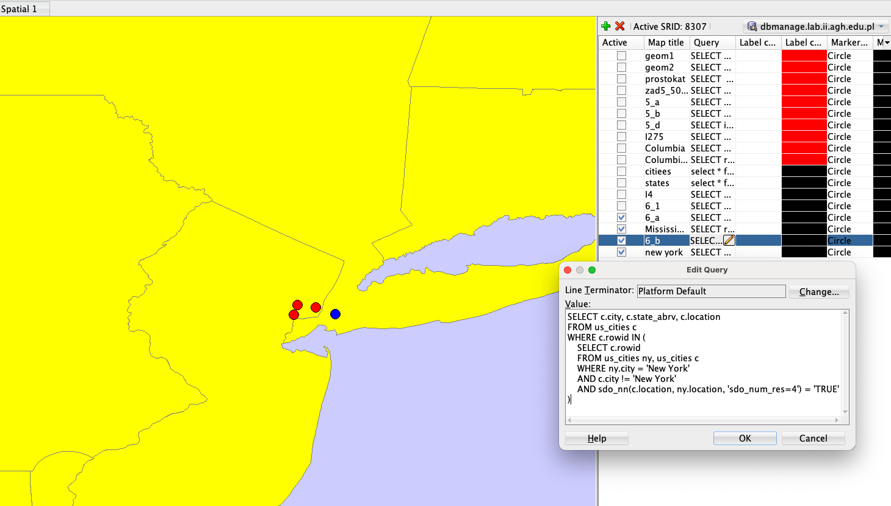

c)     Znajdz kilka jednostek administracyjnych (us_counties) z których jest najbliżej do Nowego Jorku

```sql
SELECT co.county, co.state_abrv, co.geom
FROM us_counties co
WHERE co.rowid IN (
    SELECT co.rowid
    FROM us_cities ny, us_counties co
    WHERE ny.city = 'New York'
    AND sdo_nn(co.geom, ny.location, 'sdo_num_res=6') = 'TRUE'
)
```
Wizualizacja(na niebiesko zaznaczony New York):
 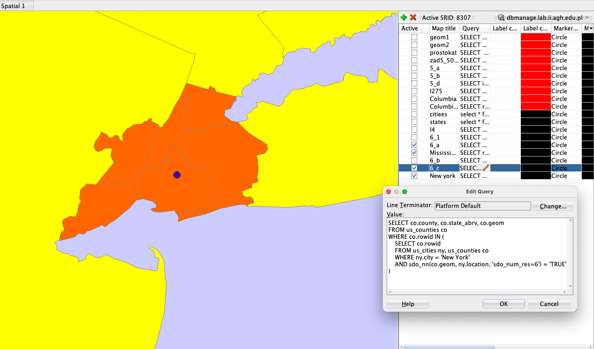

d)    Znajdz 5 najbliższych miast od drogi  'I170', podaj odległość do tych miast

```sql
Select cc.city, cc.state_abrv, cc.location, SDO_GEOM.SDO_DISTANCE(cc.location, i.geom, 0.005) AS DISTANCE
from us_cities cc,  us_interstates i
Where i.interstate = 'I170'
ORDER BY SDO_GEOM.SDO_DISTANCE(cc.location, i.geom, 0.005) ASC
fetch first 5 rows only;
```
 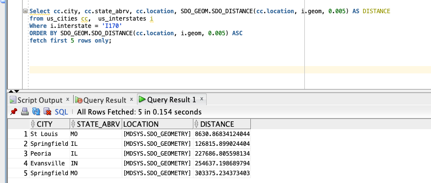

Kod do wizualizacji miast:
```sql
SELECT c.city, c.state_abrv, c.location
FROM us_cities c
WHERE c.rowid IN (
    SELECT c.rowid
    FROM us_interstates i, us_cities c
    WHERE i.interstate = 'I170'
    AND sdo_nn(c.location, i.geom, 'sdo_num_res=5') = 'TRUE'
)
```
Wizualizacja
 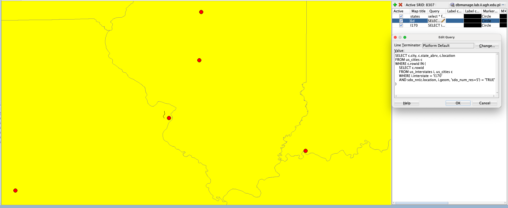

e)    Znajdz 5 najbliższych dużych miast (o populacji powyżej 300 tys) od drogi  'I170'

```sql
SELECT cc.city, cc.state_abrv, cc.location, SDO_GEOM.SDO_DISTANCE(cc.location, i.geom, 0.005) AS DISTANCE
FROM us_cities cc,  us_interstates i
WHERE i.interstate = 'I170' and cc.pop90>300000
ORDER BY SDO_GEOM.SDO_DISTANCE(cc.location, i.geom, 0.005) ASC
fetch first 5 rows only;
```
 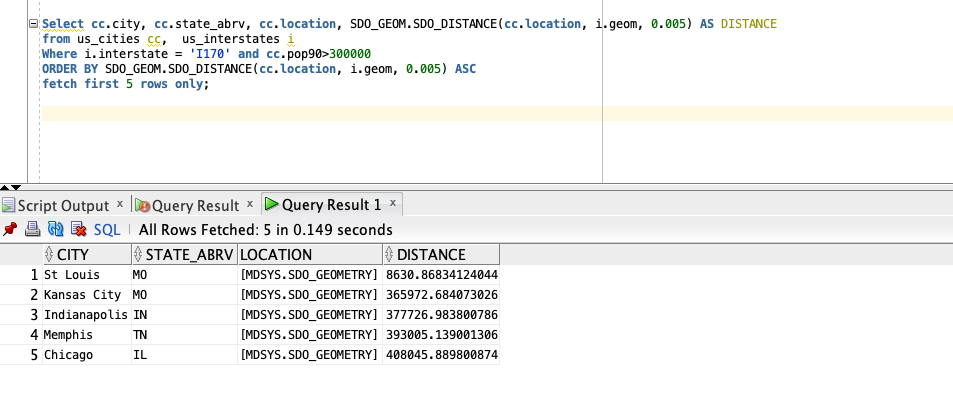

 Kod do wizualizacji miast:
```sql
SELECT c.city, c.state_abrv, c.location
FROM us_cities c
WHERE c.rowid IN (
    SELECT c.rowid
    FROM us_interstates i, us_cities c
    WHERE i.interstate = 'I170' and c.pop90>300000
    AND sdo_nn(c.location, i.geom, 'sdo_num_res=5') = 'TRUE'
)
```

Wizualizacja na mapie
 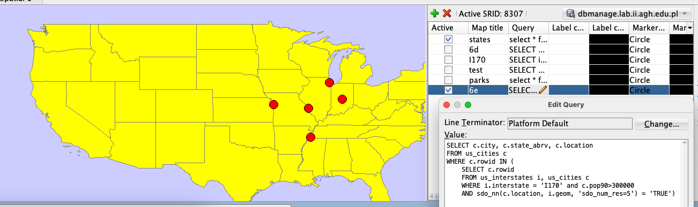

f)      Itp. (własne przykłady)


> Wyniki, zrzut ekranu, komentarz
> (dla każdego z podpunktów)

Znajdz 5 najblisze miasta od rzeki Columbia i podaj ich populacje i odleglosc od rzeki


```sql
SELECT cc.city, cc.state_abrv, cc.location, SDO_GEOM.SDO_DISTANCE(cc.location, r.geom, 0.005) AS DISTANCE, cc.pop90
FROM us_cities cc,  us_rivers r
WHERE r.name = 'Columbia'
ORDER BY SDO_GEOM.SDO_DISTANCE(cc.location, r.geom, 0.005) ASC
FETCH FIRST 5 ROWS only;
```
 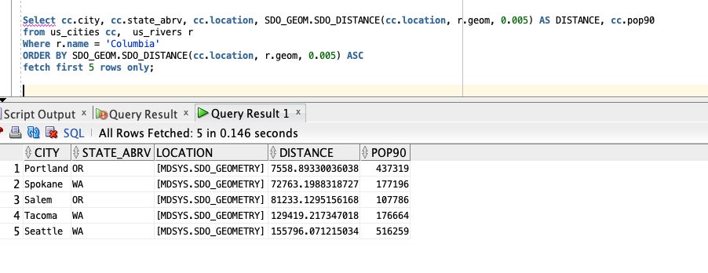


Wizualizacja na mapie
 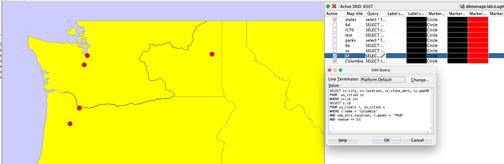


# Zadanie 7

Oblicz długość drogi I4

```sql
SELECT SDO_GEOM.SDO_LENGTH (geom, 0.5,'unit=kilometer') length
FROM us_interstates
WHERE interstate = 'I4';
```


>Wyniki, zrzut ekranu, komentarz

```sql
--  ...
```


Dodatkowo:

a)     Oblicz długość rzeki Mississippi

b)    Która droga jest najdłuższa/najkrótsza

c)     Która rzeka jest najdłuższa/najkrótsza

d)    Które stany mają najdłuższą granicę

e)    Itp. (własne przykłady)


> Wyniki, zrzut ekranu, komentarz
> (dla każdego z podpunktów)

```sql
--  ...
```

Oblicz odległość między miastami Buffalo i Syracuse

```sql
SELECT SDO_GEOM.SDO_DISTANCE ( c1.location, c2.location, 0.5) distance
FROM us_cities c1, us_cities c2
WHERE c1.city = 'Buffalo' and c2.city = 'Syracuse';
```


>Wyniki, zrzut ekranu, komentarz

```sql
--  ...
```

Dodatkowo:

a)     Oblicz odległość między miastem Tampa a drogą I4

b)    Jaka jest odległość z między stanem Nowy Jork a  Florydą

c)     Jaka jest odległość z między miastem Nowy Jork a  Florydą

d)    Podaj 3 parki narodowe do których jest najbliżej z Nowego Jorku, oblicz odległości do tych parków

e)    Przetestuj działanie funkcji

a.     sdo_intersection, sdo_union, sdo_difference

b.     sdo_buffer

c.     sdo_centroid, sdo_mbr, sdo_convexhull, sdo_simplify

f)      Itp. (własne przykłady)


> Wyniki, zrzut ekranu, komentarz
> (dla każdego z podpunktów)

```sql
--  ...
```


Zadanie 8

Wykonaj kilka własnych przykładów/analiz


>Wyniki, zrzut ekranu, komentarz

```sql
--  ...
```

Punktacja

|   |   |
|---|---|
|zad|pkt|
|1|0,5|
|2|1|
|3|1|
|4|1|
|5|3|
|6|3|
|7|6|
|8|4|
|razem|20|
