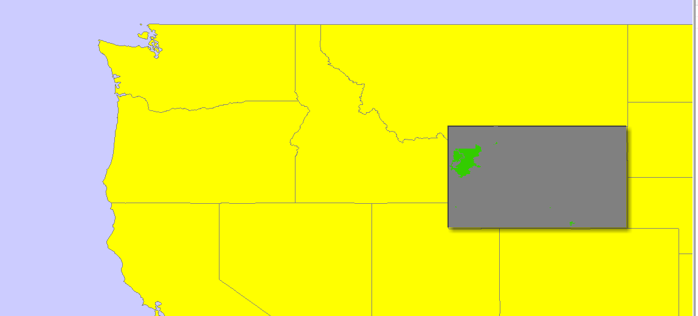
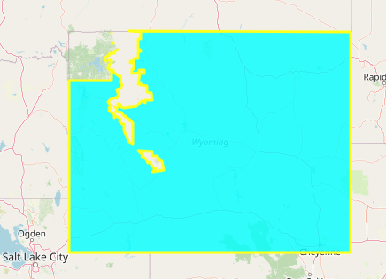

# Raport

# Przetwarzanie i analiza danych przestrzennych 
# Oracle spatial


---

**Imiona i nazwiska:**

Judyta Bąkowska, Karolina Źróbek

--- 

Celem ćwiczenia jest zapoznanie się ze sposobem przechowywania, przetwarzania i analizy danych przestrzennych w bazach danych
(na przykładzie systemu Oracle spatial)

Swoje odpowiedzi wpisuj w miejsca oznaczone jako:

---
> Wyniki, zrzut ekranu, komentarz

```sql
--  ...
```

---

Do wykonania ćwiczenia (zadania 1 – 7) i wizualizacji danych wykorzystaj Oracle SQL Develper. Alternatywnie możesz wykonać analizy w środowisku Python/Jupyter Notebook

Do wykonania zadania 8 wykorzystaj środowisko Python/Jupyter Notebook

Raport należy przesłać w formacie pdf.

Należy też dołączyć raport zawierający kod w formacie źródłowym.

Np.
- plik tekstowy .sql z kodem poleceń
- plik .md zawierający kod wersji tekstowej
- notebook programu jupyter – plik .ipynb

Zamieść kod rozwiązania oraz zrzuty ekranu pokazujące wyniki, (dołącz kod rozwiązania w formie tekstowej/źródłowej)

Zwróć uwagę na formatowanie kodu

<div style="page-break-after: always;"></div>

# Zadanie 1

Zwizualizuj przykładowe dane

US_STATES
```sql
SELECT * FROM US_STATES
```


US_INTERSTATES

```sql
SELECT * FROM US_INTERSTATES
```


US_CITIES

```sql
SELECT * FROM US_CITIES WHERE STATE_ABRV='NY';
SELECT * FROM US_STATES WHERE STATE='New York';
```


US_RIVERS


```sql
SELECT * FROM US_REVIERS
```


US_COUNTIES


```sql
SELECT * FROM US_COUNTIES WHERE STATE_ABRV = 'NY'
```


US_PARKS


```sql
SELECT * FROM US_PARKS
```


# Zadanie 2

Znajdź wszystkie stany (us_states) których obszary mają część wspólną ze wskazaną geometrią (prostokątem)

Pokaż wynik na mapie.

prostokąt

```sql
SELECT  sdo_geometry (2003, 8307, null,
sdo_elem_info_array (1,1003,3),
sdo_ordinate_array ( -117.0, 40.0, -90., 44.0)) g
FROM dual
```


> Wyniki, zrzut ekranu, komentarz

```sql
--  ...
```


Użyj funkcji SDO_FILTER

```sql
SELECT state, geom FROM us_states
WHERE sdo_filter (geom,
sdo_geometry (2003, 8307, null,
sdo_elem_info_array (1,1003,3),
sdo_ordinate_array ( -117.0, 40.0, -90., 44.0))
) = 'TRUE';
```

Zwróć uwagę na liczbę zwróconych wierszy (16)


> Wyniki, zrzut ekranu, komentarz

```sql
--  ...
```


Użyj funkcji  SDO_ANYINTERACT

```sql
SELECT state, geom FROM us_states
WHERE sdo_anyinteract (geom,
sdo_geometry (2003, 8307, null,
sdo_elem_info_array (1,1003,3),
sdo_ordinate_array ( -117.0, 40.0, -90., 44.0))
) = 'TRUE';
```

Porównaj wyniki sdo_filter i sdo_anyinteract

Pokaż wynik na mapie


> Wyniki, zrzut ekranu, komentarz

```sql
--  ...
```

# Zadanie 3

Znajdź wszystkie parki (us_parks) których obszary znajdują się wewnątrz stanu Wyoming

Użyj funkcji SDO_INSIDE

```sql
SELECT p.name, p.geom
FROM us_parks p, us_states s
WHERE s.state = 'Wyoming'
AND SDO_INSIDE (p.geom, s.geom ) = 'TRUE';
```

W przypadku wykorzystywania narzędzia SQL Developer, w celu wizualizacji na mapie użyj podzapytania

```sql
SELECT pp.name, pp.geom  FROM us_parks pp
WHERE id IN
(
    SELECT p.id
    FROM us_parks p, us_states s
    WHERE s.state = 'Wyoming'
    and SDO_INSIDE (p.geom, s.geom ) = 'TRUE'
)
```





```sql
SELECT state, geom FROM us_states
WHERE state = 'Wyoming'
```

Funkcja `SDO_INSIDE` wybiera jedynie parki które w całości zawieraja się w terytorium stanu Wyoming.


Porównaj wynik z:

```sql
SELECT p.name, p.geom
FROM us_parks p, us_states s
WHERE s.state = 'Wyoming'
AND SDO_ANYINTERACT (p.geom, s.geom ) = 'TRUE';
```

W celu wizualizacji użyj podzapytania


Funkcja `SDO_ANYINTERACT` wybiera parki które przynajmniej w części znajdują się na terytorium stanu Wyoming.


# Zadanie 4

Znajdź wszystkie jednostki administracyjne (us_counties) wewnątrz stanu New Hampshire

```sql
SELECT c.county, c.state_abrv, c.geom
FROM us_counties c, us_states s
WHERE s.state = 'New Hampshire'
AND SDO_RELATE ( c.geom,s.geom, 'mask=INSIDE+COVEREDBY') = 'TRUE';

SELECT c.county, c.state_abrv, c.geom
FROM us_counties c, us_states s
WHERE s.state = 'New Hampshire'
AND SDO_RELATE ( c.geom,s.geom, 'mask=INSIDE') = 'TRUE';

SELECT c.county, c.state_abrv, c.geom
FROM us_counties c, us_states s
WHERE s.state = 'New Hampshire'
AND SDO_RELATE ( c.geom,s.geom, 'mask=COVEREDBY') = 'TRUE';
```

W przypadku wykorzystywania narzędzia SQL Developer, w celu wizualizacji danych na mapie należy użyć podzapytania (podobnie jak w poprzednim zadaniu)


> Wyniki, zrzut ekranu, komentarz

```sql
--  ...
```

# Zadanie 5

Znajdź wszystkie miasta w odległości 50 mili od drogi (us_interstates) I4

Pokaż wyniki na mapie

```sql
SELECT * FROM us_interstates
WHERE interstate = 'I4'

SELECT * FROM us_states
WHERE state_abrv = 'FL'

SELECT c.city, c.state_abrv, c.location 
FROM us_cities c
WHERE ROWID IN 
( 
SELECT c.rowid
FROM us_interstates i, us_cities c 
WHERE i.interstate = 'I4'
AND sdo_within_distance (c.location, i.geom,'distance=50 unit=mile'
)
```


> Wyniki, zrzut ekranu, komentarz

```sql
--  ...
```


Dodatkowo:

a)     Znajdz wszystkie jednostki administracyjne przez które przechodzi droga I4

b)    Znajdz wszystkie jednostki administracyjne w pewnej odległości od I4

c)     Znajdz rzeki które przecina droga I4

d)    Znajdz wszystkie drogi które przecinają rzekę Mississippi

e)    Znajdz wszystkie miasta w odlegości od 15 do 30 mil od drogi 'I275'

f)      Itp. (własne przykłady)


> Wyniki, zrzut ekranu, komentarz
> (dla każdego z podpunktów)

```sql
--  ...
```

# Zadanie 6

Znajdz 5 miast najbliższych drogi I4

```sql
SELECT c.city, c.state_abrv, c.location
FROM us_interstates i, us_cities c 
WHERE i.interstate = 'I4'
AND sdo_nn(c.location, i.geom, 'sdo_num_res=5') = 'TRUE';
```

>Wyniki, zrzut ekranu, komentarz

```sql
--  ...
```


Dodatkowo:

a)     Znajdz kilka miast najbliższych rzece Mississippi

b)    Znajdz 3 miasta najbliżej Nowego Jorku

c)     Znajdz kilka jednostek administracyjnych (us_counties) z których jest najbliżej do Nowego Jorku

d)    Znajdz 5 najbliższych miast od drogi  'I170', podaj odległość do tych miast

e)    Znajdz 5 najbliższych dużych miast (o populacji powyżej 300 tys) od drogi  'I170'

f)      Itp. (własne przykłady)


> Wyniki, zrzut ekranu, komentarz
> (dla każdego z podpunktów)

```sql
--  ...
```


# Zadanie 7

Oblicz długość drogi I4

```sql
SELECT SDO_GEOM.SDO_LENGTH (geom, 0.5,'unit=kilometer') length
FROM us_interstates
WHERE interstate = 'I4';
```


Długość drogi I4 wynosi: 212.260756199927 km


Dodatkowo:

a)     Oblicz długość rzeki Mississippi: 3860.32566492228 km
``` sql
SELECT SDO_GEOM.SDO_LENGTH (geom, 0.5,'unit=kilometer') length
FROM us_rivers
WHERE name = 'Mississippi';
```

b)    Która droga jest najdłuższa/najkrótsza: 

Najkrótsza: I564	0.462140186764249 km

Najdłuższa:  I90	4290.6462617249 km

```sql
SELECT interstate, SDO_GEOM.SDO_LENGTH (geom, 0.5,'unit=kilometer') length
FROM us_interstates
ORDER BY length
FETCH FIRST 1 ROW ONLY;

SELECT interstate, SDO_GEOM.SDO_LENGTH (geom, 0.5,'unit=kilometer') length
FROM us_interstates
ORDER BY length DESC
FETCH FIRST 1 ROW ONLY;
```

c)     Która rzeka jest najdłuższa/najkrótsza:

Najkrótsza: Richelieu	1.16169766454518 km

Najdłuższa:  St. Clair	6950.91937515048 km

```sql
SELECT name, SDO_GEOM.SDO_LENGTH (geom, 0.5,'unit=kilometer') length
FROM us_rivers
ORDER BY length
FETCH FIRST 1 ROW ONLY;

SELECT name, SDO_GEOM.SDO_LENGTH (geom, 0.5,'unit=kilometer') length
FROM us_rivers
ORDER BY length DESC
FETCH FIRST 1 ROW ONLY;
```

d)    Które stany mają najdłuższą granicę

Alaska	26138.3745019651 km
Texas	6779.84795094551 km
California	4145.76647746918 km

```sql
SELECT state, SDO_GEOM.SDO_LENGTH (geom, 0.5,'unit=kilometer') length
FROM us_states
ORDER BY length DESC
FETCH FIRST 3 ROW ONLY;
```


Oblicz odległość między miastami Buffalo i Syracuse

```sql
SELECT SDO_GEOM.SDO_DISTANCE ( c1.location, c2.location, 0.5) distance
FROM us_cities c1, us_cities c2
WHERE c1.city = 'Buffalo' and c2.city = 'Syracuse';
```
Distance = 222184.610363969 km


Dodatkowo:

a)     Oblicz odległość między miastem Tampa a drogą I4


```sql
SELECT SDO_GEOM.SDO_DISTANCE ( c.location, i.geom, 0.5) distance
FROM us_interstates i, us_cities c
WHERE c.city = 'Tampa' and i.interstate = 'I4'
```

            DISTANCE
    0	3103.911721

b)    Jaka jest odległość z między stanem Nowy Jork a  Florydą
```sql
SELECT SDO_GEOM.SDO_DISTANCE ( s1.geom, s2.geom, 0.5) distance
FROM us_states s1, us_states s2
WHERE s1.state = 'Florida' and s2.state = 'New York'

```
            DISTANCE
    0	1.256584e+06


c)     Jaka jest odległość z między miastem Nowy Jork a  Florydą
```sql
SELECT SDO_GEOM.SDO_DISTANCE ( c.location, s2.geom, 0.5) distance
FROM us_cities c, us_states s2
WHERE c.city = 'New York' and s2.state = 'Florida'

```
            DISTANCE
    0	1.296591e+06

d)    Podaj 3 parki narodowe do których jest najbliżej z Nowego Jorku, oblicz odległości do tych parków

```sql
SELECT p.name, SDO_GEOM.SDO_DISTANCE ( c.location, p.geom, 0.5) distance
FROM us_parks p, us_cities c 
WHERE c.city = 'New York'
AND sdo_nn(c.location, p.geom, 'sdo_num_res=3') = 'TRUE'
ORDER BY distance 
FETCH FIRST 3 ROW ONLY
``` 
            NAME	        DISTANCE
    0	Institute Park	1539.893923
    1	Prospect Park	1718.069260
    2	Thompkins Park	2135.556723

#### e)    Przetestuj działanie funkcji sdo_intersection, sdo_union, sdo_difference, sdo_buffer, sdo_centroid, sdo_mbr, sdo_convexhull, sdo_simplify

Działanie zaprezentowane na przykładzie parków narodowych znajdujących się częściowo lub w całości na terenie stanu Wyoming. Funkcje pomocnicze:

```python

def show_on_map(
    query, 
    style= {
    'fillColor': 'cyan', 
    'color': 'yellow',
    'fillOpacity': '0.8'}, 
    m_map = None):
    rows = loads(cursor.execute(query).fetchall())
    
    m_list = []
    
    if(m_map == None):
        m_map = folium.Map()

    for row in rows:
        geo_data = geojson.Feature(
            geometry=row[0], 
            properties={})
        m_list.append(geo_data)
    
    feature_collection = geojson.FeatureCollection(m_list)
    folium.GeoJson(
        feature_collection, 
        style_function=lambda x:style
        ).add_to(m_map)  
     
    return m_map 

    import pandas as pd

# Helper function
def execute_query(query):
    cursor = connection.cursor()
    cursor.execute(query)
    col_names = [row[0] for row in cursor.description]
    rows = cursor.fetchall()
    df = pd.DataFrame(rows, columns=col_names)
    return df

```
### `sdo_union (SDO_AGGR_UNION)`
```python
## Parki przecinajce sie ze stanem Wyoming - wybierzmy 3 o najwiekszej powierzchni
# i połaczymy je w jeden geom za pomoca union
query = """ SELECT p.name, SDO_GEOM.SDO_AREA(p.geom) 
as area
FROM us_parks p, us_states s
WHERE s.state = 'Wyoming'
AND SDO_ANYINTERACT (p.geom, s.geom ) = 'TRUE'
ORDER BY area DESC
FETCH FIRST 3 ROW ONLY
"""
execute_query(query)


```
            NAME	        AREA
    0	Shoshone NF	9.866570e+09
    1	Yellowstone NP	8.895585e+09
    2	Gallatin NF	8.704383e+09

```python 
# połączenie powierzchni 3 parkow
query_mega_park = """ 
SELECT 
sdo_util.to_wktgeometry(
SDO_AGGR_UNION(SDOAGGRTYPE(p.geom, 0.05)))
AS union_geom
FROM us_parks p, us_states s
WHERE s.state = 'Wyoming'
  AND SDO_ANYINTERACT(p.geom, s.geom) = 'TRUE'
  AND p.name IN (
    SELECT p.name
    FROM us_parks p, us_states s
    WHERE s.state = 'Wyoming'
      AND SDO_ANYINTERACT(p.geom, s.geom) = 'TRUE'
    ORDER BY SDO_GEOM.SDO_AREA(p.geom) DESC
    FETCH FIRST 3 ROWS ONLY
)

"""

# stan Wyoming
query_wyoming = """
SELECT sdo_util.to_wktgeometry(s.geom)
FROM  us_states s
WHERE s.state = 'Wyoming'
"""
show_on_map(
    query_mega_park, 
    {'color': 'green', 'fillColor': 'forest'},
    m_map = show_on_map(query_wyoming) )
```


### `sdo_intersect`
```python
query = """

WITH
mega_park AS (
    SELECT SDO_AGGR_UNION(
    SDOAGGRTYPE(p.geom, 0.05)) 
    AS union_geom
    FROM us_parks p
    JOIN us_states s 
    ON 
    SDO_ANYINTERACT(p.geom, s.geom) = 'TRUE'
    WHERE s.state = 'Wyoming'
      AND p.name IN (
        SELECT p.name
        FROM us_parks p
        JOIN us_states s ON SDO_ANYINTERACT(
        p.geom, 
        s.geom) = 'TRUE'
        WHERE s.state = 'Wyoming'
        ORDER BY SDO_GEOM.SDO_AREA(p.geom) DESC
        FETCH FIRST 3 ROWS ONLY
    )
),
wyoming_state AS (
    SELECT s.geom AS state_geom
    FROM us_states s
    WHERE s.state = 'Wyoming'
)
SELECT sdo_util.to_wktgeometry(
    sdo_geom.sdo_intersection(
    wyoming_state.state_geom, 
    mega_park.union_geom, 
    0.05
    )
) AS intersection_geom
FROM wyoming_state, mega_park


"""

show_on_map(query)

```


### `sdo_difference`
```python
query = """

WITH
mega_park AS (
    SELECT SDO_AGGR_UNION(SDOAGGRTYPE(p.geom, 0.05)) 
    AS union_geom
    FROM us_parks p
    JOIN us_states s 
    ON 
    SDO_ANYINTERACT(p.geom, s.geom) = 'TRUE'
    WHERE s.state = 'Wyoming'
      AND p.name IN (
        SELECT p.name
        FROM us_parks p
        JOIN us_states s ON SDO_ANYINTERACT(p.geom, s.geom) = 'TRUE'
        WHERE s.state = 'Wyoming'
        ORDER BY SDO_GEOM.SDO_AREA(p.geom) DESC
        FETCH FIRST 3 ROWS ONLY
    )
),
wyoming_state AS (
    SELECT s.geom AS state_geom
    FROM us_states s
    WHERE s.state = 'Wyoming'
)
SELECT sdo_util.to_wktgeometry(
    sdo_geom.sdo_intersection(
    wyoming_state.state_geom, 
    mega_park.union_geom, 
    0.05
    )
) AS intersection_geom
FROM wyoming_state, mega_park


"""

show_on_map(query)

```


#### `sdo_buffer, sdo_centroid, sdo_mbr, sdo_convexhull`
Na przykładzie parku Yellowstone

```python
query_buffer = """
SELECT sdo_util.to_wktgeometry(sdo_geom.sdo_buffer(geom, 100))
FROM us_parks
WHERE name='Yellowstone NP'
"""

query_centroid = """
SELECT sdo_util.to_wktgeometry(sdo_geom.sdo_centroid(geom))
FROM us_parks
WHERE name='Yellowstone NP'
"""
query_mbr = """
SELECT sdo_util.to_wktgeometry(
    sdo_geom.sdo_mbr(geom)
)
FROM us_parks
WHERE name='Yellowstone NP'
"""
query_convexhull = """
SELECT sdo_util.to_wktgeometry(
    sdo_geom.sdo_convexhull(geom)
)
FROM us_parks
WHERE name='Yellowstone NP'
"""
query_simplify = """
SELECT sdo_util.to_wktgeometry(
    sdo_util.sdo_simplify(geom,
    6,
   0.5)
)
FROM us_parks
WHERE name='Yellowstone NP'
"""

styles = {
    'buffer': {'color': 'blue', 'fillColor': 'blue'},
    'centroid': {'color': 'green', 'fillColor': 'green'},
    'mbr': {'color': 'orange', 'fillColor': 'orange'},
    'convexhull': {'color': 'purple', 'fillColor': 'purple'},
    'simplify': {'color': 'red', 'fillColor': 'red'}
}


show_on_map(
    query_convexhull, style=styles['convexhull'], m_map=show_on_map(
        query_mbr, style=styles['mbr'], m_map=show_on_map(
            query_centroid, style=styles['centroid'], m_map=show_on_map(
                query_buffer, style=styles['buffer']
            )
        )
    )
)

show_on_map(query_simplify, style=styles['simplify'])
```
#### Legenda:

- <span style="color:blue">sdo_buffer</span>
- sdo_centroid - pinezka
- <span style="color:orange">sdo_mbr</span>
- <span style="color:purple">sdo_convexhull</span>
- <span style="color:red">sdo_simplify</span>


# Zadanie 8

### Analiza 1: wyszukiwanie trasy z miasta do miasta
Punkty miast w bazie `US_SPAT` zazwyczaj nie sa zlokalizowane wewnatrz wieloktów (`geom'ów`) dróg.  
Dlatego aby uzyskać informację, jakie drogi dochodza do danego miasta posłużymy się przybliżeniem. 
Tworzymy zestawienie miast i dróg znajdujcych się w promieniu 10 mil. 
Użyjemy wyłcznie miast w stanie New York aby ograniczyć liczbe miast następujce wyszukiwanie tras w grafie  było możliwe. 

```python
interstates_10miles = """
SELECT c.city, i.interstate
FROM us_cities c
JOIN us_interstates i ON sdo_within_distance(
    c.location,
    i.geom,
    'distance=10 unit=mile'
) = 'TRUE'
WHERE c.state_abrv = 'NY'
"""

interstates_10miles = execute_query(interstates_10miles)
interstates_10miles.head()
```
            CITY	        INTERSTATE
    0	Rochester	I390
    1	Buffalo	I190
    2	New York	I278
    3	Yonkers	I278
    4	Yonkers	I287


Na tej podstawie mozemy wyszukać dostępne trasy pomiędzy Nowym Yorkiem a Buffalo:

```python
df = interstates_10miles

# Function to find connections between two cities
def find_connections(city1, city2):
    connections = []
    interstates_city1 = df.loc[df['CITY'] == city1, 'INTERSTATE'].tolist()
    interstates_city2 = df.loc[df['CITY'] == city2, 'INTERSTATE'].tolist()
    for interstate1 in interstates_city1:
        for interstate2 in interstates_city2:
            connections.append([interstate1, interstate2])
    return connections

# Example cities
city1 = 'Buffalo'
city2 = 'New York'

# Find connections between the given cities
connections = find_connections(city1, city2)
for connection in connections:
    print(connection)

```

    ['I190', 'I278']
    ['I190', 'I478']
    ['I190', 'I495']
    ['I190', 'I678']
    ['I190', 'I78']
    ['I190', 'I87']
    ['I190', 'I95']
    ['I290', 'I278']
    ['I290', 'I478']
    ['I290', 'I495']
    ['I290', 'I678']
    ['I290', 'I78']
    ['I290', 'I87']
    ['I290', 'I95']
    ['I90', 'I278']
    ['I90', 'I478']
    ['I90', 'I495']
    ['I90', 'I678']
    ['I90', 'I78']
    ['I90', 'I87']
    ['I90', 'I95']
    ['I990', 'I278']
    ['I990', 'I478']
    ['I990', 'I495']
    ['I990', 'I678']
    ['I990', 'I78']
    ['I990', 'I87']
    ['I990', 'I95']

Wizualizacja wynikow:import random
```python
def random_color():
    # Generate random values for red, green, and blue components
    r = random.randint(0, 255)
    g = random.randint(0, 255)
    b = random.randint(0, 255)

    # Convert the RGB values to hexadecimal format
    color_hex = '#{:02x}{:02x}{:02x}'.format(r, g, b)
    return color_hex

connections_vis = []
for connection in connections:
    query = """
         SELECT sdo_util.to_wktgeometry(geom)
         FROM us_interstates 
         WHERE interstate ="""
    interstates_str = ""
    for interstate in connection:
         interstates_str = interstates_str + "'" 
         + interstate + "'" + " OR interstate="
    interstates_str = interstates_str[: -15]
    query  = query + interstates_str
         
    connections_vis.append(query)

routes_map = folium.Map()
for route in connections_vis:
    color = random_color()
    routes_map = show_on_map(
    route, 
    style = {'color':color, 'fillColor': color }, 
    m_map=routes_map
    )

cities_query = """
SELECT sdo_util.to_wktgeometry(location)
FROM US_CITIES 
WHERE city = 'New York' OR city = 'Buffalo'
"""
show_on_map(cities_query, m_map=routes_map)
```


Wizualizacja zawiera wszystkie drogi którymi można przejechać między miastami. Poszczególne trasy oznacone są osobymi kolorami. Wizualizację można by jeszcze udoskolanić, pomieważ obecnie zawarte są w niej pełne kształty tras -> fragmenty dróg wyjeżdżające poza NY albo Buffalo także są przedstawione na mapie.


### Analiza 2

Punktacja

|   |   |
|---|---|
|zad|pkt|
|1|0,5|     K
|2|1| J
|3|1|   K
|4|1| J
|5|3| J
|6|3| J
|7|6|   K
|8|4| J K
|razem|20|