# Indeksy,  optymalizator <br>Lab 4

<!-- <style scoped>
 p,li {
    font-size: 12pt;
  }
</style>  -->

<!-- <style scoped>
 pre {
    font-size: 8pt;
  }
</style>  -->


---
**Imię i nazwisko:**

Judyta Bąkowska, Karolina Źróbek
--- 

Celem ćwiczenia jest zapoznanie się z planami wykonania zapytań (execution plans), oraz z budową i możliwością wykorzystaniem indeksów.

Swoje odpowiedzi wpisuj w miejsca oznaczone jako:

---
> Wyniki: 

```sql
--  ...
```

---

Ważne/wymagane są komentarze.

Zamieść kod rozwiązania oraz zrzuty ekranu pokazujące wyniki, (dołącz kod rozwiązania w formie tekstowej/źródłowej)

Zwróć uwagę na formatowanie kodu

## Oprogramowanie - co jest potrzebne?

Do wykonania ćwiczenia potrzebne jest następujące oprogramowanie
- MS SQL Server,
- SSMS - SQL Server Management Studio    
- przykładowa baza danych AdventureWorks2017.
    
Oprogramowanie dostępne jest na przygotowanej maszynie wirtualnej


## Przygotowanie  

Uruchom Microsoft SQL Managment Studio.
    
Stwórz swoją bazę danych o nazwie XYZ. 

```sql
create database xyz  
go  
  
use xyz  
go
```

Wykonaj poniższy skrypt, aby przygotować dane:

```sql
select * into [salesorderheader]  
from [adventureworks2017].sales.[salesorderheader]  
go  
  
select * into [salesorderdetail]  
from [adventureworks2017].sales.[salesorderdetail]  
go
```

## Dokumentacja/Literatura

Celem tej części ćwiczenia jest zapoznanie się z planami wykonania zapytań (execution plans) oraz narzędziem do automatycznego generowania indeksów.

Przydatne materiały/dokumentacja. Proszę zapoznać się z dokumentacją:
- [https://docs.microsoft.com/en-us/sql/tools/dta/tutorial-database-engine-tuning-advisor](https://docs.microsoft.com/en-us/sql/tools/dta/tutorial-database-engine-tuning-advisor)
- [https://docs.microsoft.com/en-us/sql/relational-databases/performance/start-and-use-the-database-engine-tuning-advisor](https://docs.microsoft.com/en-us/sql/relational-databases/performance/start-and-use-the-database-engine-tuning-advisor)
- [https://www.simple-talk.com/sql/performance/index-selection-and-the-query-optimizer](https://www.simple-talk.com/sql/performance/index-selection-and-the-query-optimizer)

Ikonki używane w graficznej prezentacji planu zapytania opisane są tutaj:
- [https://docs.microsoft.com/en-us/sql/relational-databases/showplan-logical-and-physical-operators-reference](https://docs.microsoft.com/en-us/sql/relational-databases/showplan-logical-and-physical-operators-reference)


<div style="page-break-after: always;"></div>

# Zadanie 1 - Obserwacja

Wpisz do MSSQL Managment Studio (na razie nie wykonuj tych zapytań):

```sql
-- zapytanie 1  
select *  
from salesorderheader sh  
inner join salesorderdetail sd on sh.salesorderid = sd.salesorderid  
where orderdate = '2008-06-01 00:00:00.000'  
go  
  
-- zapytanie 2  
select orderdate, productid, sum(orderqty) as orderqty, 
       sum(unitpricediscount) as unitpricediscount, sum(linetotal)  
from salesorderheader sh  
inner join salesorderdetail sd on sh.salesorderid = sd.salesorderid  
group by orderdate, productid  
having sum(orderqty) >= 100  
go  
  
-- zapytanie 3  
select salesordernumber, purchaseordernumber, duedate, shipdate  
from salesorderheader sh  
inner join salesorderdetail sd on sh.salesorderid = sd.salesorderid  
where orderdate in ('2008-06-01','2008-06-02', '2008-06-03', '2008-06-04', '2008-06-05')  
go  
  
-- zapytanie 4  
select sh.salesorderid, salesordernumber, purchaseordernumber, duedate, shipdate  
from salesorderheader sh  
inner join salesorderdetail sd on sh.salesorderid = sd.salesorderid  
where carriertrackingnumber in ('ef67-4713-bd', '6c08-4c4c-b8')  
order by sh.salesorderid  
go
```


Włącz dwie opcje: **Include Actual Execution Plan** oraz **Include Live Query Statistics**:


<!-- ![[_img/index1-1.png | 500]] -->


Teraz wykonaj poszczególne zapytania (najlepiej każde analizuj oddzielnie). Co można o nich powiedzieć? Co sprawdzają? Jak można je zoptymalizować?  
(Hint: aby wykonać tylko fragment kodu SQL znajdującego się w edytorze, zaznacz go i naciśnij F5)

---
> Wyniki: 

>**Zapytanie 1:**
Wybiera wszystkie kolumny z tabeli salesorderheader oraz salesorderdetail, gdzie data zamówienia (orderdate) wynosi '2008-06-01 00:00:00.000'.
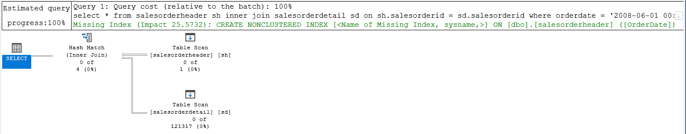


>**Zapytanie 2:**
Wybiera datę zamówienia (orderdate), identyfikator produktu (productid), sumę zamówionych ilości (orderqty), sumę rabatu jednostkowego (unitpricediscount) oraz sumę całkowitą linii (linetotal) z tabel salesorderheader i salesorderdetail.
Wyniki grupowane są według daty zamówienia i identyfikatora produktu.
Tylko te wyniki, gdzie suma zamówionych ilości jest większa lub równa 100, są uwzględniane.
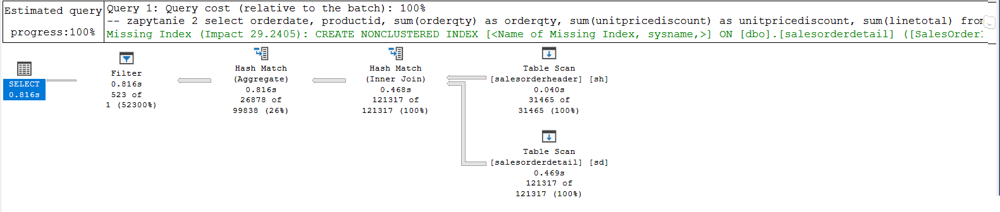

>**Zapytanie 3:**
Wybiera numery zamówienia (salesordernumber), numery zamówienia zakupu (purchaseordernumber), datę płatności (duedate) oraz datę wysyłki (shipdate) z tabel salesorderheader i salesorderdetail.
Wyniki ograniczane są do tych, gdzie data zamówienia jest jedną z dat: '2008-06-01', '2008-06-02', '2008-06-03', '2008-06-04', '2008-06-05'.
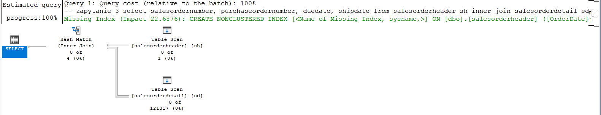

>**Zapytanie 4:**
Wybiera identyfikator zamówienia (salesorderid), numer zamówienia (salesordernumber), numer zamówienia zakupu (purchaseordernumber), datę płatności (duedate) oraz datę wysyłki (shipdate) z tabel salesorderheader i salesorderdetail.
Wyniki ograniczane są do tych, gdzie numer śledzenia przewoźnika (carriertrackingnumber) jest jednym z podanych: 'ef67-4713-bd', '6c08-4c4c-b8'.
Wyniki sortowane są według identyfikatora zamówienia (salesorderid) rosnąco.
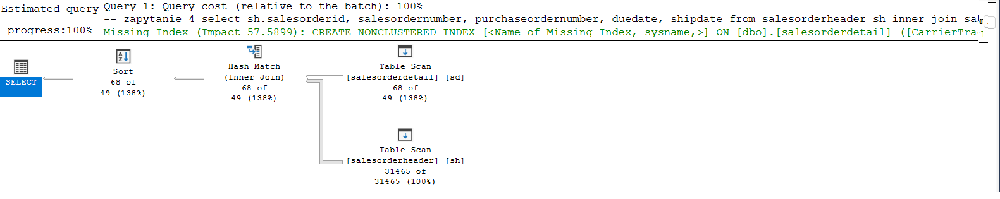

>**Optymalizacja**
>
>Szybkość wykonania mogłaby zostać poprawiona dzięki:
>- Indeksowaniu kolumn wykorzystywanych w warunkach łączenia JOIN oraz warunkach filtra WHERE, HAVING może poprawić szybkość wykonania.
>- Unikanie funkcji w warunkach filtra. Mogą one powodować, że baza danych nie korzysta z indeksów. Na przykład, w zapytaniu 3, data zamówienia jest używana w warunku, ale użyto funkcji IN. Lepszym rozwiązaniem byłoby użycie zakresu dat.
>- Używanie EXISTS zamiast IN. 
>- Zgrupowane indeksy na kolumnach uzywanych w warunkach filtra. Na przykład `orderdate` i `productid` w zapytaniu 2.


---


<div style="page-break-after: always;"></div>

# Zadanie 2 - Optymalizacja

Zaznacz wszystkie zapytania, i uruchom je w **Database Engine Tuning Advisor**:

<!-- ![[_img/index1-12.png | 500]] -->


Sprawdź zakładkę **Tuning Options**, co tam można skonfigurować?

---
> Wyniki: 
>
>*Indexes and Indexed Views*
>- Clustered Indexes: Opcja ta zaleca stosowanie indeksów klastrów w celu poprawy wydajności zapytań. Indeksy klastrów sortują fizycznie dane w tabeli na podstawie klucza indeksu, co może przyspieszyć wyszukiwanie.
>- Nonclustered Indexes: Zaleca używanie indeksów nieklastrów do szybkiego wyszukiwania danych na podstawie innych kolumn niż kolumny indeksu.
>- Filtered Indexes: Pozwala na tworzenie indeksów filtrowanych, które obejmują tylko określone wiersze z tabeli, co może zmniejszyć rozmiar indeksu i przyspieszyć zapytania.
>
>*Recommend Columnstore Indexes*
>
>Zaleca stosowanie indeksów kolumnowych (columnstore indexes), które są specjalnym rodzajem indeksu zaprojektowanym do szybkiego przetwarzania dużych ilości danych analitycznych.
>
>*Evaluate Utilization of Existing PDS Only*
>Narzędzie DTA będzie oceniać wykorzystanie istniejących struktur fizycznych bazy danych, takich jak indeksy, a nie będzie proponować tworzenia nowych.
>
>*Partitioning Strategy to Employ*
>- No Partitioning: Nie stosuje partycjonowania.
>- Full Partitioning: Proponuje pełne partycjonowanie, które dzieli dane na logiczne partycje na podstawie określonej kolumny lub wyrażenia.
>- Aligned Partitioning: Stosuje partycjonowanie zgodne, w którym granice partycji są wyrównane z granicami partycji na dysku, co może przyspieszyć zarządzanie partycjami.
>
>*Physical Design Structures (PDS) to Keep in Database*
>- Do Not Keep Any Existing PDS: Nie zachowuje żadnych istniejących struktur fizycznych.
>- Keep All Existing PDS: Zachowuje wszystkie istniejące struktury fizyczne, takie jak indeksy i widoki indeksowane.
>- Keep Clustered Indexes Only: Zachowuje tylko indeksy klastrów.
Keep Aligned Partitioning: Zachowuje tylko partycjonowanie zgodne.


---


Użyj **Start Analysis**:

<!-- ![[_img/index1-3.png | 500]] -->


Zaobserwuj wyniki w **Recommendations**.

Przejdź do zakładki **Reports**. Sprawdź poszczególne raporty. Główną uwagę zwróć na koszty i ich poprawę:


<!-- ![[_img/index4-1.png | 500]] -->


Zapisz poszczególne rekomendacje:

Uruchom zapisany skrypt w Management Studio.

Opisz, dlaczego dane indeksy zostały zaproponowane do zapytań:

---
> Wyniki: 
>
>Indeks na kolumnie `OrderDate` w tabeli `salesorderheader` powinien przyspieszyć filtrowanie po dacie zamówienia. Indeks na kolumnie `SalesOrderID` w tabeli `salesorderdetail `wspomoże operację łączenia (JOIN).
>
>Indeks złożony na kolumnach `OrderDate` i `ProductID` w tabeli `salesorderheader` pozwoli na szybsze grupowanie. Ponownie indeks na kolumnie `SalesOrderID` w tabeli `salesorderdetail` wspomoże łączenie.
>
>Indeks na kolumnie `OrderDate` w tabeli `salesorderheader` pozwoli na szybsze filtrowanie po dacie zamówienia. Indeks na kolumnie `SalesOrderID` w tabeli salesorderdetail wspomoże operację łączenia.
>
>Indeks na kolumnie `CarrierTrackingNumber` w tabeli `salesorderdetail` przyspieszy filtrowanie po numerze śledzenia przewoźnika. Indeks na kolumnie SalesOrderID w tabeli salesorderheader wspomoże łączenie.

```sql
CREATE NONCLUSTERED INDEX [_dta_index_salesorderdetail_11_597577167__K1_2_3_4_5_6_7_8_9_10_11] ON [dbo].[salesorderdetail]
(
	[SalesOrderID] ASC
)
INCLUDE([SalesOrderDetailID],[CarrierTrackingNumber],[OrderQty],[ProductID],[SpecialOfferID],[UnitPrice],[UnitPriceDiscount],[LineTotal],[rowguid],[ModifiedDate]) 
WITH (SORT_IN_TEMPDB = OFF, DROP_EXISTING = OFF, ONLINE = OFF) ON [PRIMARY]
go

CREATE NONCLUSTERED INDEX [_dta_index_salesorderdetail_11_597577167__K1_K5_4_8_9] ON [dbo].[salesorderdetail]
(
	[SalesOrderID] ASC,
	[ProductID] ASC
)
INCLUDE([OrderQty],[UnitPriceDiscount],[LineTotal]) WITH (SORT_IN_TEMPDB = OFF, DROP_EXISTING = OFF, ONLINE = OFF) ON [PRIMARY]
go

SET ANSI_PADDING ON
go

CREATE NONCLUSTERED INDEX [_dta_index_salesorderdetail_11_597577167__K3_K1] ON [dbo].[salesorderdetail]
(
	[CarrierTrackingNumber] ASC,
	[SalesOrderID] ASC
)WITH (SORT_IN_TEMPDB = OFF, DROP_EXISTING = OFF, ONLINE = OFF) ON [PRIMARY]
go

CREATE STATISTICS [_dta_stat_597577167_1_3] ON [dbo].[salesorderdetail]([SalesOrderID], [CarrierTrackingNumber])
go

CREATE NONCLUSTERED INDEX [_dta_index_salesorderheader_11_581577110__K3_K1_2_4_5_6_7_8_9_10_11_12_13_14_15_16_17_18_19_20_21_22_23_24_25_26] ON [dbo].[salesorderheader]
(
	[OrderDate] ASC,
	[SalesOrderID] ASC
)
INCLUDE([RevisionNumber],[DueDate],[ShipDate],[Status],[OnlineOrderFlag],[SalesOrderNumber],[PurchaseOrderNumber],[AccountNumber],[CustomerID],[SalesPersonID],
	[TerritoryID],[BillToAddressID],[ShipToAddressID],[ShipMethodID],[CreditCardID],[CreditCardApprovalCode],[CurrencyRateID],[SubTotal],[TaxAmt],[Freight],
	[TotalDue],[Comment],[rowguid],[ModifiedDate]) WITH (SORT_IN_TEMPDB = OFF, DROP_EXISTING = OFF, ONLINE = OFF) ON [PRIMARY]
go

CREATE NONCLUSTERED INDEX [_dta_index_salesorderheader_11_581577110__K1_4_5_8_9] ON [dbo].[salesorderheader]
(
	[SalesOrderID] ASC
)
INCLUDE([DueDate],[ShipDate],[SalesOrderNumber],[PurchaseOrderNumber]) WITH (SORT_IN_TEMPDB = OFF, DROP_EXISTING = OFF, ONLINE = OFF) ON [PRIMARY]
go

CREATE NONCLUSTERED INDEX [_dta_index_salesorderheader_11_581577110__K1_K3] ON [dbo].[salesorderheader]
(
	[SalesOrderID] ASC,
	[OrderDate] ASC
)WITH (SORT_IN_TEMPDB = OFF, DROP_EXISTING = OFF, ONLINE = OFF) ON [PRIMARY]
go
```

---


Sprawdź jak zmieniły się Execution Plany. Opisz zmiany:

---
> Wyniki:
>
>**Zapytanie 1:**
>
>Po zastosowaniu indeksu na kolumnie OrderDate w tabeli salesorderheader oraz indeksu na kolumnie SalesOrderID w tabeli salesorderdetail, optymalizator zapytań może wykorzystać te indeksy do szybkiego odnalezienia odpowiednich wierszy. Plan wykonania może więc zawierać operację indeksowego skanu (index scan) lub indeksowego poszukiwania (index seek), co przyspieszy filtrację wyników.
Zapytanie 2 (grupowanie po dacie zamówienia i identyfikatorze produktu):
>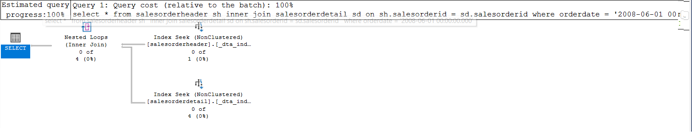

>**Zapytanie 2:**
>
>Dodanie indeksu złożonego na kolumnach OrderDate i ProductID w tabeli salesorderheader pozwoli na efektywne grupowanie danych. Optymalizator zapytań może wykorzystać ten indeks, co może spowodować zmianę planu wykonania na bardziej wydajny, wykorzystujący indeksowe operacje grupowania (index grouping operations).
>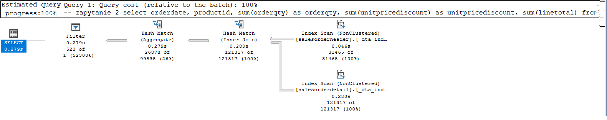

>
>**Zapytanie 3:**
>
>Zastosowanie indeksu na kolumnie OrderDate w tabeli salesorderheader pozwoli na szybkie odnalezienie odpowiednich zamówień na podstawie daty zamówienia. Plan wykonania może zawierać indeksowe poszukiwanie (index seek) lub indeksowy skan (index scan), co przyspieszy filtrowanie wyników.
> 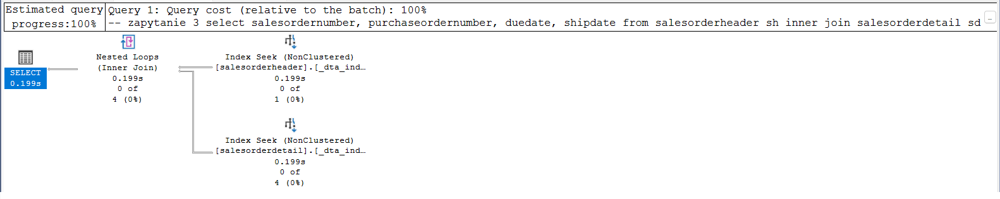


> **Zapytanie 4:**
>
>Dodanie indeksu na kolumnie CarrierTrackingNumber w tabeli salesorderdetail umożliwi szybkie odnalezienie odpowiednich zamówień na podstawie numeru śledzenia przewoźnika. Optymalizator zapytań może wykorzystać ten indeks do przyspieszenia operacji filtrowania. Plan wykonania może więc zawierać indeksowe poszukiwanie (index seek) lub indeksowy skan (index scan), zamiast pełnego skanu tabeli, co znacząco poprawi wydajność zapytania.
>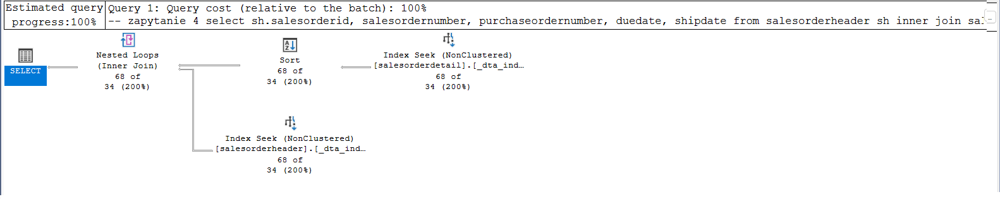
---


<div style="page-break-after: always;"></div>

# Zadanie 3 - Kontrola "zdrowia" indeksu

## Dokumentacja/Literatura

Celem kolejnego zadania jest zapoznanie się z możliwością administracji i kontroli indeksów.

Na temat wewnętrznej struktury indeksów można przeczytać tutaj:
- [https://technet.microsoft.com/en-us/library/2007.03.sqlindex.aspx](https://technet.microsoft.com/en-us/library/2007.03.sqlindex.aspx)
- [https://docs.microsoft.com/en-us/sql/relational-databases/system-dynamic-management-views/sys-dm-db-index-physical-stats-transact-sql](https://docs.microsoft.com/en-us/sql/relational-databases/system-dynamic-management-views/sys-dm-db-index-physical-stats-transact-sql)
- [https://docs.microsoft.com/en-us/sql/relational-databases/system-dynamic-management-views/sys-dm-db-index-physical-stats-transact-sql](https://docs.microsoft.com/en-us/sql/relational-databases/system-dynamic-management-views/sys-dm-db-index-physical-stats-transact-sql)
- [https://docs.microsoft.com/en-us/sql/relational-databases/system-catalog-views/sys-indexes-transact-sql](https://docs.microsoft.com/en-us/sql/relational-databases/system-catalog-views/sys-indexes-transact-sql)

Sprawdź jakie informacje można wyczytać ze statystyk indeksu:

```sql
select *  
from sys.dm_db_index_physical_stats (db_id('adventureworks2017')  
,object_id('humanresources.employee')  
,null -- null to view all indexes; otherwise, input index number  
,null -- null to view all partitions of an index  
,'detailed') -- we want all information
```


Jakie są według Ciebie najważniejsze pola?

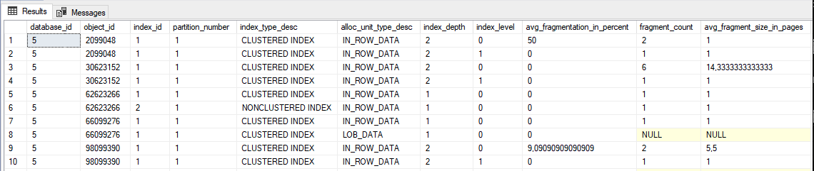
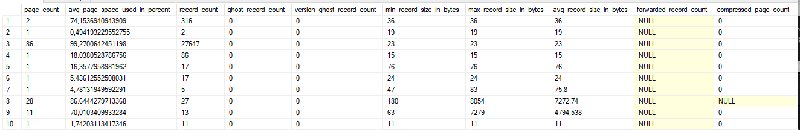
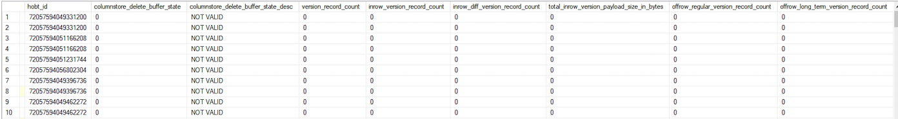

---
> Wyniki: 

- `avg_fragmentation_in_percent`: Procent fragmentacji w indeksie. Wysokie wartości mogą sugerować potrzebę defragmentacji.
- `page_count`: Wskaźnik wielkości indeksu, ważny dla oceny jego wydajności.
- `avg_page_space_used_in_percent`: Pokazuje, jak efektywnie wykorzystywane jest miejsce na stronie indeksu.
- `forwarded_record_count`: Ilość przekierowanych rekordów, istotna dla oceny wydajności indeksów nieklastrowych.
- `index_type_desc` i `alloc_unit_type_desc`: Typ indeksu i typ jednostki alokacji, które pomagają zrozumieć strukturę i zastosowanie indeksu.
- `index_depth`: Głębokość drzewa indeksu, wpływająca na ilość operacji wejścia/wyjścia potrzebnych do odnalezienia danych.

---


Sprawdź, które indeksy w bazie danych wymagają reorganizacji:

```sql
use adventureworks2017  
  
select object_name([object_id]) as 'table name',  
index_id as 'index id'  
from sys.dm_db_index_physical_stats (db_id('adventureworks2017')  
,null -- null to view all tables  
,null -- null to view all indexes; otherwise, input index number  
,null -- null to view all partitions of an index  
,'detailed') --we want all information  
where ((avg_fragmentation_in_percent > 10  
and avg_fragmentation_in_percent < 15) -- logical fragmentation  
or (avg_page_space_used_in_percent < 75  
and avg_page_space_used_in_percent > 60)) --page density  
and page_count > 8 -- we do not want indexes less than 1 extent in size  
and index_id not in (0) --only clustered and nonclustered indexes
```


---
> Wyniki: 
> zrzut ekranu/komentarz:

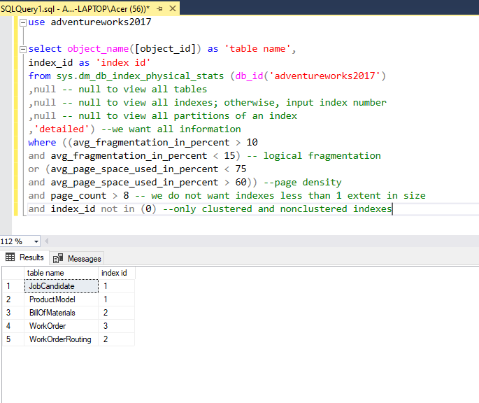
 W bazie 'AdventureWorks2017' znaleziono 5 tabel mających po jednym indeksie wymagającym reorganizacji:
- `JobCandidate` - indeks o ID 1
- `ProductModel` - indeks o ID 1
- `BillOfMaterials` - indeks o ID 2
- `WorkOrder` - indeks o ID 3
- `WorkOrderRouting` - indeks o ID 2

---


Sprawdź, które indeksy w bazie danych wymagają przebudowy:

```sql
use adventureworks2017  
  
select object_name([object_id]) as 'table name',  
index_id as 'index id'  
from sys.dm_db_index_physical_stats (db_id('adventureworks2017')  
,null -- null to view all tables  
,null -- null to view all indexes; otherwise, input index number  
,null -- null to view all partitions of an index  
,'detailed') --we want all information  
where ((avg_fragmentation_in_percent > 15) -- logical fragmentation  
or (avg_page_space_used_in_percent < 60)) --page density  
and page_count > 8 -- we do not want indexes less than 1 extent in size  
and index_id not in (0) --only clustered and nonclustered indexes
```

---
> Wyniki: 
> zrzut ekranu/komentarz:

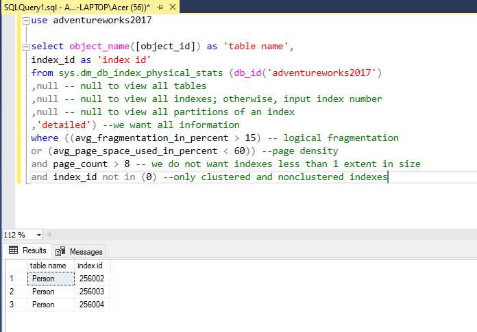

W bazie danych `AdventureWorks2017`, indeksy z tabeli `Person` wymagające przebudowy to:

- Indeks o ID 256002
- Indeks o ID 256003
- Indeks o ID 256004


---

Czym się różni przebudowa indeksu od reorganizacji?

(Podpowiedź: [http://blog.plik.pl/2014/12/defragmentacja-indeksow-ms-sql.html](http://blog.plik.pl/2014/12/defragmentacja-indeksow-ms-sql.html))

---
> Wyniki: 

- **Przebudowa (`REBUILD`)**: Zalecana dla indeksów mocno pofragmentowanych. Jest to intensywniejszy proces, który odbudowuje indeks od podstaw. Może bć bardziej wydajny niż sama reorganizacja indesku.
- **Reorganizacja indeksu (`REORGANIZE`)**: jest procesem optymalizacji wykorzystywanym, gdy fragmentacja indeksu jest umiarkowana. Jest to operacja mniej zasobożerna, która może być przeprowadzona on-line i nie zakłóca normalnej pracy bazy danych.


---

Sprawdź co przechowuje tabela sys.dm_db_index_usage_stats:

---
> Wyniki: 

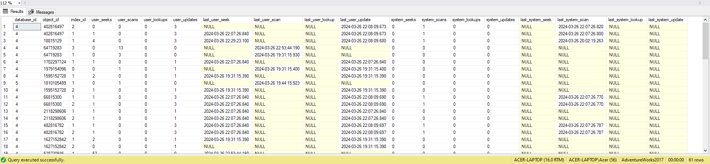
---


Napraw wykryte błędy z indeksami ze wcześniejszych zapytań. Możesz użyć do tego przykładowego skryptu:

```sql
use adventureworks2017  
  
--table to hold results  
declare @tablevar table(lngid int identity(1,1), objectid int,  
index_id int)  
  
insert into @tablevar (objectid, index_id)  
select [object_id],index_id  
from sys.dm_db_index_physical_stats (db_id('adventureworks2017')  
,null -- null to view all tables  
,null -- null to view all indexes; otherwise, input index number  
,null -- null to view all partitions of an index  
,'detailed') --we want all information  
where ((avg_fragmentation_in_percent > 15) -- logical fragmentation  
or (avg_page_space_used_in_percent < 60)) --page density  
and page_count > 8 -- we do not want indexes less than 1 extent in size  
and index_id not in (0) --only clustered and nonclustered indexes  
  
select 'alter index ' + ind.[name] + ' on ' + sc.[name] + '.'  
+ object_name(objectid) + ' rebuild'  
from @tablevar tv  
inner join sys.indexes ind  
on tv.objectid = ind.[object_id]  
and tv.index_id = ind.index_id  
inner join sys.objects ob  
on tv.objectid = ob.[object_id]  
inner join sys.schemas sc  
on sc.schema_id = ob.schema_id
```


Napisz przygotowane komendy SQL do naprawy indeksów:

---
> Wyniki: 

```sql
ALTER INDEX XMLPATH_Person_Demographics ON Person.Person rebuild;
ALTER INDEX XMLPROPERTY_Person_Demographics ON Person.Person rebuild;
ALTER INDEX XMLVALUE_Person_Demographics ON Person.Person rebuild;
```

---

<div style="page-break-after: always;"></div>

# Zadanie 4 - Budowa strony indeksu

## Dokumentacja

Celem kolejnego zadania jest zapoznanie się z fizyczną budową strony indeksu 
- [https://www.mssqltips.com/sqlservertip/1578/using-dbcc-page-to-examine-sql-server-table-and-index-data/](https://www.mssqltips.com/sqlservertip/1578/using-dbcc-page-to-examine-sql-server-table-and-index-data/)
- [https://www.mssqltips.com/sqlservertip/2082/understanding-and-examining-the-uniquifier-in-sql-server/](https://www.mssqltips.com/sqlservertip/2082/understanding-and-examining-the-uniquifier-in-sql-server/)
- [http://www.sqlskills.com/blogs/paul/inside-the-storage-engine-using-dbcc-page-and-dbcc-ind-to-find-out-if-page-splits-ever-roll-back/](http://www.sqlskills.com/blogs/paul/inside-the-storage-engine-using-dbcc-page-and-dbcc-ind-to-find-out-if-page-splits-ever-roll-back/)

Wypisz wszystkie strony które są zaalokowane dla indeksu w tabeli. Użyj do tego komendy np.:

```sql
dbcc ind ('adventureworks2017', 'person.address', 1)  
-- '1' oznacza nr indeksu
```

Zapisz sobie kilka różnych typów stron, dla różnych indeksów:

---
> Wyniki: 

<pre class="hljs"><code><div style="font-size: 0.4em;">
 PageFID	PagePID	IAMFID	IAMPID	ObjectID	IndexID	PartitionNumber	PartitionID	iam_chain_type	PageType	IndexLevel	NextPageFID	NextPagePID	PrevPageFID	PrevPagePID
1	10474	NULL	NULL	1029578706	1	1	72057594047889408	In-row data	10	NULL	0	0	0	0
1	11712	1	10474	1029578706	1	1	72057594047889408	In-row data	1	0	1	11713	1	12010
1	11713	1	10474	1029578706	1	1	72057594047889408	In-row data	1	0	1	11714	1	11712
1	11714	1	10474	1029578706	1	1	72057594047889408	In-row data	1	0	1	11715	1	11713
 </div></code></pre>

 ```sql
dbcc ind ('adventureworks2017', 'production.document', 1)  
```

<pre class="hljs"><code><div style="font-size: 0.4em;">
 PageFID	PagePID	IAMFID	IAMPID	ObjectID	IndexID	PartitionNumber	PartitionID	iam_chain_type	PageType	IndexLevel	NextPageFID	NextPagePID	PrevPageFID	PrevPagePID
1	1133	NULL	NULL	1733581214	1	1	72057594049003520	In-row data	10	NULL	0	0	0	0
1	800	1	1133	1733581214	1	1	72057594049003520	In-row data	1	0	0	0	0	0
1	2104	NULL	NULL	1733581214	1	1	72057594049003520	LOB data	10	NULL	0	0	0	0
1	2096	1	2104	1733581214	1	1	72057594049003520	LOB data	3	0	0	0	0	0
1	2112	1	2104	1733581214	1	1	72057594049003520	LOB data	3	0	0	0	0	0
1	2113	1	2104	1733581214	1	1	72057594049003520	LOB data	3	0	0	0	0	0
1	2136	1	2104	1733581214	1	1	72057594049003520	LOB data	4	0	0	0	0	0
</div></code></pre>
---

Włącz flagę 3604 zanim zaczniesz przeglądać strony:

```sql
dbcc traceon (3604);
```

Sprawdź poszczególne strony komendą DBCC PAGE. np.:

```sql
dbcc page('adventureworks2017', 1, 13720, 3);
```


Zapisz obserwacje ze stron. Co ciekawego udało się zaobserwować?

---
> Wyniki: 

typ strony = 1

Długość wierszy:
1. 1378 bity
2. 1388
3. 1374
4. 1390
5. 1368
Liczba wolnych bajtów: 1188

Nie da się wstawić następnego wiersza na tej stronie samej długości


```sql
dbcc traceon (3604);
dbcc page('adventureworks2017', 1, 2136	, 3);
```

typ strony = 4

W tym przypadku mamy typ danych LOB


Informacja, którą dysponujemy:

  - Blob Id: Identyfikator Bloba.
  - Level: Poziom Bloba.
  - MaxLinks: Maksymalna liczba linków do Bloba.
  - CurLinks: Aktualna liczba linków do Bloba.
  - Dzieci: Lista dzieci Bloba, informacje o ich lokalizacji, rozmiarze i przesunięciu.


```sql
dbcc traceon (3604);
dbcc page('adventureworks2017', 1, 2113, 3);
```

typ strony = 3

W tym przypadku oprócz Blow ID otrzymujemy dane Bloba jako szestanstkową reprezentację binarnych danych


---

Punktacja:

|   |   |
|---|---|
|zadanie|pkt|
|1|3|
|2|3|
|3|3|
|4|1|
|razem|10|