# Indeksy,  optymalizator <br>Lab 5

<!-- <style scoped>
 p,li {
    font-size: 12pt;
  }
</style>  -->

<!-- <style scoped>
 pre {
    font-size: 8pt;
  }
</style>  -->


---

**Imię i nazwisko:**
Judyta Bąkowska, Kraolina Źróbek

--- 

Celem ćwiczenia jest zapoznanie się z planami wykonania zapytań (execution plans), oraz z budową i możliwością wykorzystaniem indeksów (cz. 2.)

Swoje odpowiedzi wpisuj w miejsca oznaczone jako:

---
> Wyniki: 

```sql
--  ...
```

---

Ważne/wymagane są komentarze.

Zamieść kod rozwiązania oraz zrzuty ekranu pokazujące wyniki, (dołącz kod rozwiązania w formie tekstowej/źródłowej)

Zwróć uwagę na formatowanie kodu

## Oprogramowanie - co jest potrzebne?

Do wykonania ćwiczenia potrzebne jest następujące oprogramowanie
- MS SQL Server,
- SSMS - SQL Server Management Studio    
- przykładowa baza danych AdventureWorks2017.
    
Oprogramowanie dostępne jest na przygotowanej maszynie wirtualnej


## Przygotowanie  

Uruchom Microsoft SQL Managment Studio.
    
Stwórz swoją bazę danych o nazwie XYZ. 

```sql
create database lab5  
go  
  
use lab5  
go
```


## Dokumentacja/Literatura

Obowiązkowo:

- [https://docs.microsoft.com/en-us/sql/relational-databases/indexes/indexes](https://docs.microsoft.com/en-us/sql/relational-databases/indexes/indexes)
- [https://docs.microsoft.com/en-us/sql/relational-databases/sql-server-index-design-guide](https://docs.microsoft.com/en-us/sql/relational-databases/sql-server-index-design-guide)
- [https://www.simple-talk.com/sql/performance/14-sql-server-indexing-questions-you-were-too-shy-to-ask/](https://www.simple-talk.com/sql/performance/14-sql-server-indexing-questions-you-were-too-shy-to-ask/)

Materiały rozszerzające:
- [https://www.sqlshack.com/sql-server-query-execution-plans-examples-select-statement/](https://www.sqlshack.com/sql-server-query-execution-plans-examples-select-statement/)

<div style="page-break-after: always;"></div>

# Zadanie 1 - Indeksy klastrowane I nieklastrowane

Skopiuj tabelę `Customer` do swojej bazy danych:

```sql
select * into customer from adventureworks2017.sales.customer
```

Wykonaj analizy zapytań:

```sql
select * from customer where storeid = 594  
  
select * from customer where storeid between 594 and 610
```

Zanotuj czas zapytania oraz jego koszt koszt:

---
> Wyniki:
>  
> Pierwsze zapytanie: 
> 0.002s
> 
> 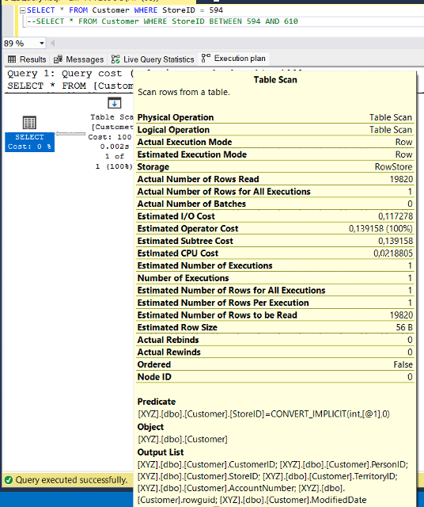
> 
> Drugie zapytanie:
> 0,002s
> 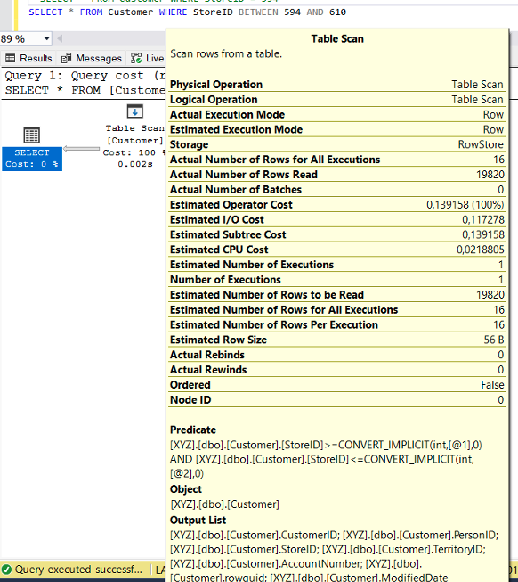


Dodaj indeks:

```sql
create index customer_store_cls_idx on customer(storeid)
```

Jak zmienił się plan i czas? Czy jest możliwość optymalizacji?


---
> Wyniki: 
>
> Pierwsze zapytanie: 
> 0.000s
> 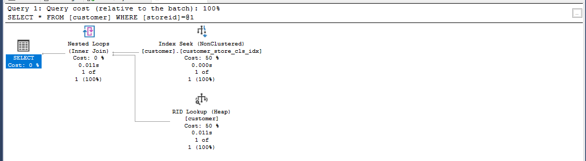
> Dwie tak samo kosztowne operacje to: Index Seek i RID Lookup
> 
> Drugie zapytanie :
> 0.000s
> 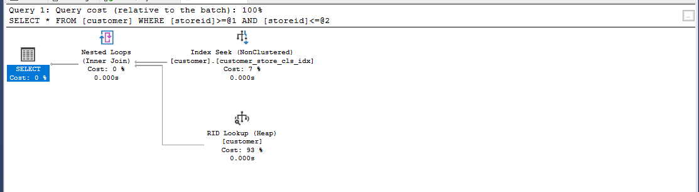
> Tutaj najkosztowniejszą operacją jest RID Lookup

**Co zmienił indeks?**

> Przyspieszył wyszukiwanie danych tworząc kopię uporządkowanej kolumny. System nie musi przeszukiwać całej tabeli w poszukiwaniu rekordów, ale korzysta z indeksu, który zawiera uporządkowane wartości z danej kolumny.


Dodaj indeks klastrowany:

```sql
create clustered index customer_store_cls_idx on customer(storeid)
```

Czy zmienił się plan i czas? Skomentuj dwa podejścia w wyszukiwaniu krotek.


---
> Wyniki: 
>
> Pierwsze zapytanie:
> 0.000s
>
> 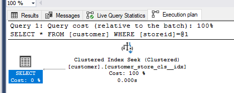
>
> Drugie zapytanie:
> 0.000s
> 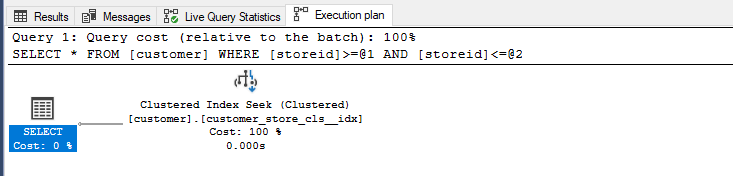
>
> Widzimy, że pierwsze zapytanie jest bardzo podobne dla obu indeksów - korzysta z wyszukiwania indeksu (Index Seek). Oba mają koszt 0.00s.
>
> Na drugim zapytaniu widzimy znaczną różnicę. W przypadku indeksu NonClustered, operacja to połączenie zagnieżdżonych pętli (Nested Loops) z wyszukiwaniem indeksu (Index Seek). W przypadku indeksu Clustered, operacja to również połączenie zagnieżdżonych pętli (Nested Loops), ale zamiast wyszukiwania indeksu, mamy bezpośrednią operację wyszukiwania identyfikatora wiersza (RID Lookup). Obie operacje mają koszt 0.00s.


# Zadanie 2 – Indeksy zawierające dodatkowe atrybuty (dane z kolumn)

Celem zadania jest poznanie indeksów z przechowujących dodatkowe atrybuty (dane z kolumn)

Skopiuj tabelę `Person` do swojej bazy danych:

```sql
select businessentityid  
      ,persontype  
      ,namestyle  
      ,title  
      ,firstname  
      ,middlename  
      ,lastname  
      ,suffix  
      ,emailpromotion  
      ,rowguid  
      ,modifieddate  
into person  
from adventureworks2017.person.person
```
---

Wykonaj analizę planu dla trzech zapytań:

```sql
select * from [person] where lastname = 'Agbonile'  
  
select * from [person] where lastname = 'Agbonile' and firstname = 'Osarumwense'  
  
select * from [person] where firstname = 'Osarumwense'
```

Co można o nich powiedzieć?


---
> Wyniki: 
> 
> Pierwsze zapytanie:
>0.002s
>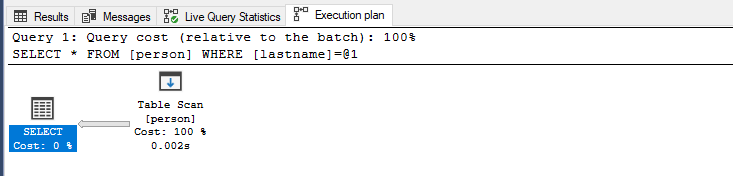
>
>Drugie zapytanie:
>0.001s
>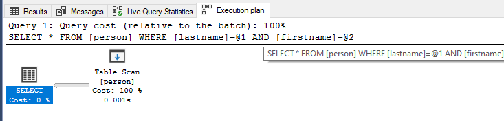
>
>Trzecie zapytanie:
>0.002s
>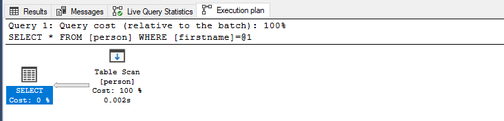
>
>W kazdym z tych trzech zapytań jest wykonywane przesiewanie tabeli (Table Scan), co oznacza, że baza danych musi przeszukać całą tabelę w poszukiwaniu pasujących rekordów.
>
>Zapytanie 2 wymaga wykonania dwóch operacji filtrowania (po lastname i firstname), co może wpłynąć na całkowity koszt operacji w porównaniu do zapytań 1 i 3, które wymagają tylko jednej operacji filtrowania.


Przygotuj indeks obejmujący te zapytania:

```sql
create index person_first_last_name_idx  
on person(lastname, firstname)
```

Sprawdź plan zapytania. Co się zmieniło?


---
> Wyniki:  
>
>Zapytanie pierwsze:
>0.000s
>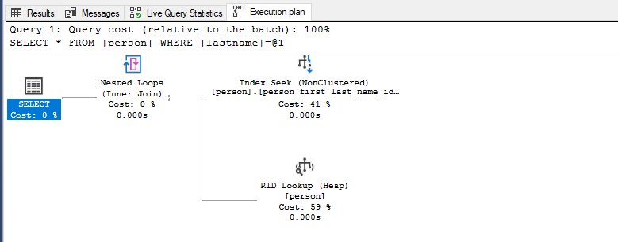
>
>Zapytanie drugie:
>0.000s
>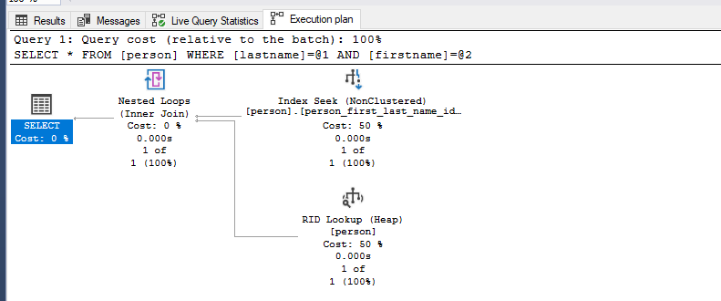
>
>Zapytanie trzecie:
>0.001s
>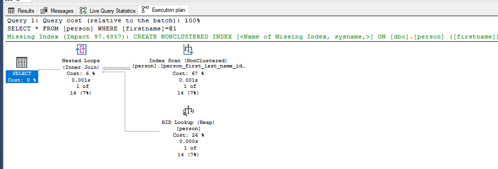
>
>W kazdym zapytaniu zamiast pełnego przesiewania tabeli (Table Scan), teraz wykorzystywane jest wyszukiwanie indeksu (Index Seek) na indeksie niemieszanym (NonClustered) person_first_last_name_idx.
>
>Dodanie indeksu obejmującego kolumny lastname i firstname pozwoliło każdemu z zapytań skorzystać z wyszukiwania indeksu, co znacząco zmniejszyło koszt operacji i poprawiło wydajność zapytań. 


Przeprowadź ponownie analizę zapytań tym razem dla parametrów: `FirstName = ‘Angela’` `LastName = ‘Price’`. (Trzy zapytania, różna kombinacja parametrów). 

Czym różni się ten plan od zapytania o `'Osarumwense Agbonile'` . Dlaczego tak jest?


---
> Wyniki: 
>
>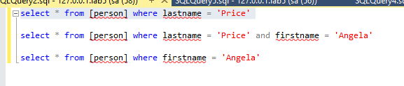
>
>Pierwsze zapytanie:
>
>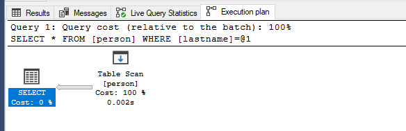
>
>Drugie zapytanie:
>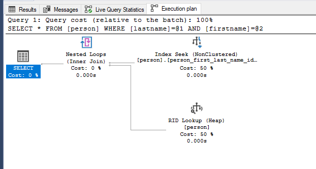
>
>Trzecie zapytanie:
>
>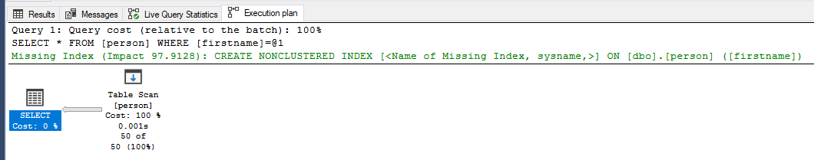
>
>Rózni się tym ze w pierszym i trzecim zapytaniu jest wykorzystywane 'Table Scan' do przeszukiwania tabeli 
>
>Zachowanie indeksów i planów wykonania zależy od konkretnych warunków zapytań i dostępności indeksów. W przypadku zapytań dotyczących 'Angela Price', dostępność indeksów i konkretna kombinacja warunków powoduje, że baza danych może wybrać różne strategie wykonania zapytań.
>
>Jeśli kolejność warunków nie jest optymalna dla dostępnego indeksu, baza danych może zdecydować się na inne strategie wykonania, takie jak pełne przesiewanie tabeli (Table Scan) lub inne operacje filtrowania.


# Zadanie 3

Skopiuj tabelę `PurchaseOrderDetail` do swojej bazy danych:

```sql
select * into purchaseorderdetail from  adventureworks2017.purchasing.purchaseorderdetail
```

Wykonaj analizę zapytania:

```sql
select rejectedqty, ((rejectedqty/orderqty)*100) as rejectionrate, productid, duedate  
from purchaseorderdetail  
order by rejectedqty desc, productid asc
```

Która część zapytania ma największy koszt?

---
> Wyniki: 
>
>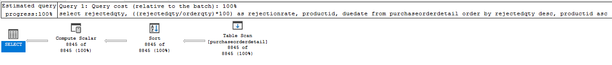
>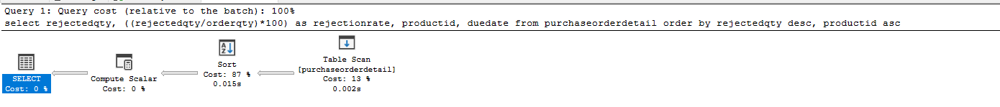
>
> Największy koszt ma opracja sortowania (order by) 

Jaki indeks można zastosować aby zoptymalizować koszt zapytania? Przygotuj polecenie tworzące index.


```sql

CREATE NONCLUSTERED INDEX [_dta_index_purchaseorderdetail_9_933578364__K9D_K5_3_4] ON [dbo].[purchaseorderdetail]
(
	[RejectedQty] DESC,
	[ProductID] ASC
)
INCLUDE([DueDate],[OrderQty]) WITH (SORT_IN_TEMPDB = OFF, DROP_EXISTING = OFF, ONLINE = OFF) ON [PRIMARY]
go


```

 Ponownie wykonaj analizę zapytania:


---
> Wyniki:
>
>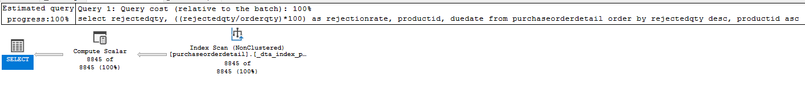
>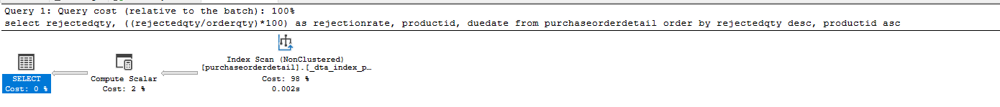
>
>Koszt sortowania (87%) w całości został zamieniony na koszt skanowania indeksu (98%). 


# Zadanie 4

Celem zadania jest porównanie indeksów zawierających wszystkie kolumny oraz indeksów przechowujących dodatkowe dane (dane z kolumn).

Skopiuj tabelę `Address` do swojej bazy danych:

```sql
select * into address from  adventureworks2017.person.address
```

W tej części będziemy analizować następujące zapytanie:

```sql
select addressline1, addressline2, city, stateprovinceid, postalcode  
from address  
where postalcode between n'98000' and n'99999'
```

```sql
create index address_postalcode_1  
on address (postalcode)  
include (addressline1, addressline2, city, stateprovinceid);  
go  
  
create index address_postalcode_2  
on address (postalcode, addressline1, addressline2, city, stateprovinceid);  
go
```


Czy jest widoczna różnica w zapytaniach? Jeśli tak to jaka? Aby wymusić użycie indeksu użyj `WITH(INDEX(Address_PostalCode_1))` po `FROM`:

> Wyniki: 
>
>Z użyciem indeksu nr 1:
>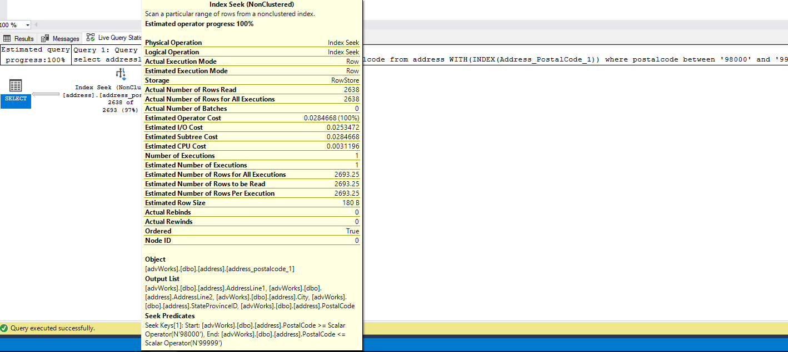
>
>Z użyciem indeksu nr 2:
>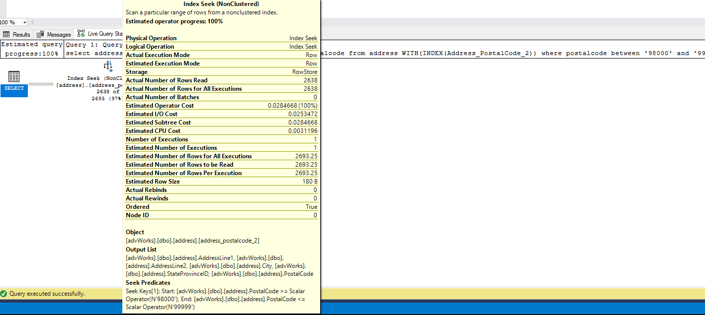
>
>
>Koszty i czasy wykonania dla obu indeksów są identyczne.


Sprawdź rozmiar Indeksów:

```sql
select i.name as indexname, sum(s.used_page_count) * 8 as indexsizekb  
from sys.dm_db_partition_stats as s  
inner join sys.indexes as i on s.object_id = i.object_id and s.index_id = i.index_id  
where i.name = 'address_postalcode_1' or i.name = 'address_postalcode_2'  
group by i.name  
go
```


Który jest większy? Jak można skomentować te dwa podejścia do indeksowania? Które kolumny na to wpływają?


> Wyniki: 
>
>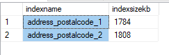
>
>Indeks nr 1 jest  mniejszy od indeksu nr 2. Dzieje się tak dlatego, że indeks nr 2 uwzględnia dodatkową kolumnę `postalcode`. Ponieważ plany wykonania są identyczne, a indeks nr 2 zajmuje więcej pamięci, bardziej optymalne jest zastosowanie indeksu nr 1. 


# Zadanie 5 – Indeksy z filtrami

Celem zadania jest poznanie indeksów z filtrami.

Skopiuj tabelę `BillOfMaterials` do swojej bazy danych:

```sql
select * into billofmaterials  
from adventureworks2017.production.billofmaterials
```


W tej części analizujemy zapytanie:

```sql
select productassemblyid, componentid, startdate  
from billofmaterials  
where enddate is not null  
    and componentid = 327  
    and startdate >= '2010-08-05'
```

Zastosuj indeks:

```sql
create nonclustered index billofmaterials_cond_idx  
    on billofmaterials (componentid, startdate)  
    where enddate is not null
```

Sprawdź czy działa. 

Przeanalizuj plan dla poniższego zapytania:

Czy indeks został użyty? Dlaczego?

> Wyniki: 
>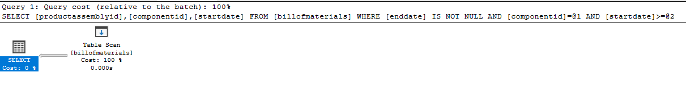
>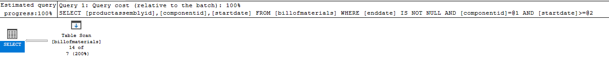
>Indeks nie został użyty. Indeks nonclustered może być mniej selektywny niż indeks typu clustered, może on obejmować więcej wierszy w wynikach przeszukiwania. W rezultacie, jeśli warunek zapytania dotyczy w sposób rozłączny składowych indeksu, optymalizator może zdecydować, że pełne przeszukiwanie sterty jest bardziej opłacalne niż korzystanie z indeksu nonclustered.


Spróbuj wymusić indeks. Co się stało, dlaczego takie zachowanie?

> Wyniki: 
>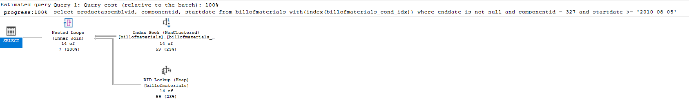
>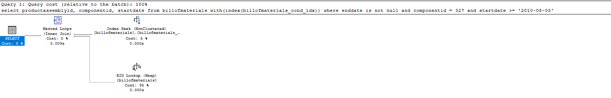
>Zgodnie z przewidywaniami, widzoczne jest przeszukiwanie sterty (heap).

---

Punktacja:

|         |     |
| ------- | --- |
| zadanie | pkt |
| 1       | 2   |
| 2       | 2   |
| 3       | 2   |
| 4       | 2   |
| 5       | 2   |
| razem   | 10  |
