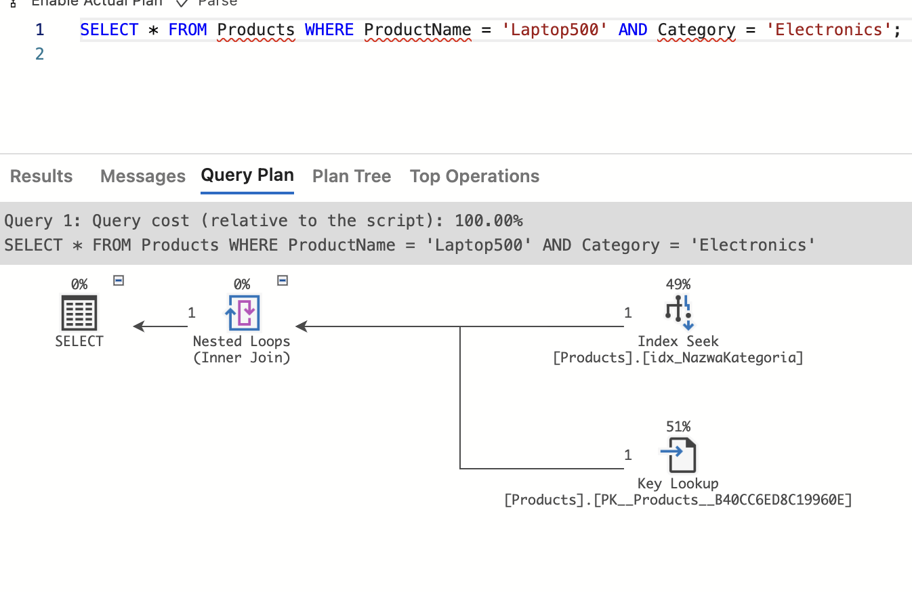
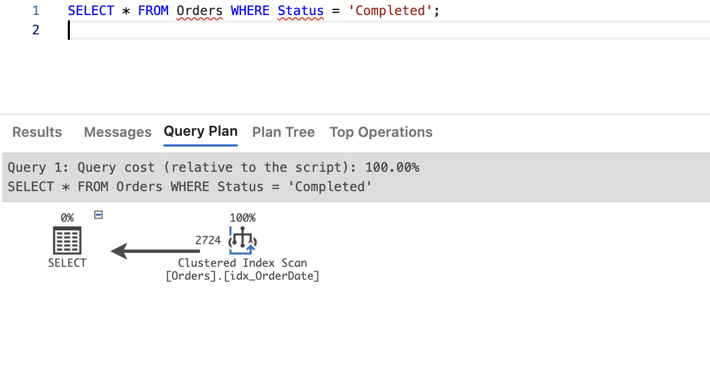

# Indeksy,  optymalizator <br>Lab 6-7

<!-- <style scoped>
 p,li {
    font-size: 12pt;
  }
</style>  -->

<!-- <style scoped>
 pre {
    font-size: 8pt;
  }
</style>  -->


---

**Imię i nazwisko:**
Judyta Bąkowska, Karolina Źróbek

--- 

Celem ćwiczenia jest zapoznanie się z planami wykonania zapytań (execution plans), oraz z budową i możliwością wykorzystaniem indeksów (cz. 2.)

Swoje odpowiedzi wpisuj w miejsca oznaczone jako:

---
> Wyniki: 

```sql
--  ...
```

---

Ważne/wymagane są komentarze.

Zamieść kod rozwiązania oraz zrzuty ekranu pokazujące wyniki, (dołącz kod rozwiązania w formie tekstowej/źródłowej)

Zwróć uwagę na formatowanie kodu

## Oprogramowanie - co jest potrzebne?

Do wykonania ćwiczenia potrzebne jest następujące oprogramowanie
- MS SQL Server,
- SSMS - SQL Server Management Studio    
- przykładowa baza danych AdventureWorks2017.
    
Oprogramowanie dostępne jest na przygotowanej maszynie wirtualnej

## Przygotowanie  


    
Stwórz swoją bazę danych o nazwie lab6. 

```sql
create database lab5  
go  
  
use lab5  
go
```

## Dokumentacja

Obowiązkowo:
- [https://docs.microsoft.com/en-us/sql/relational-databases/indexes/indexes](https://docs.microsoft.com/en-us/sql/relational-databases/indexes/indexes)
- [https://docs.microsoft.com/en-us/sql/relational-databases/indexes/create-filtered-indexes](https://docs.microsoft.com/en-us/sql/relational-databases/indexes/create-filtered-indexes)

# Zadanie 1

Skopiuj tabelę Product do swojej bazy danych:

```sql
select * into product from adventureworks2017.production.product
```

Stwórz indeks z warunkiem przedziałowym:

```sql
create nonclustered index product_range_idx  
    on product (productsubcategoryid, listprice) include (name)  
where productsubcategoryid >= 27 and productsubcategoryid <= 36
```

Sprawdź, czy indeks jest użyty w zapytaniu:

```sql
select name, productsubcategoryid, listprice  
from product  
where productsubcategoryid >= 27 and productsubcategoryid <= 36
```

Sprawdź, czy indeks jest użyty w zapytaniu, który jest dopełnieniem zbioru:

```sql
select name, productsubcategoryid, listprice  
from product  
where productsubcategoryid < 27 or productsubcategoryid > 36
```


Skomentuj oba zapytania. Czy indeks został użyty w którymś zapytaniu, dlaczego? Czy indeks nie został użyty w którymś zapytaniu, dlaczego? Jak działają indeksy z warunkiem?


---
> Wyniki: 

> Plan zapytania pierwszego zapytania:


>Komentarz:
>To zapytanie korzysta z indeksu, ponieważ warunki w zapytaniu są identyczne z warunkami w indeksie (ProductSubcategoryID >= 27 AND ProductSubcategoryID <= 36). Dodatkowo, indeksy są szczególnie skuteczne przy zapytaniach, które obejmują znacznie mniejsze fragmenty danych niż cała tabela. 

> Plan zapytania drugiego zapytania:


>Komentarz:
>W tym przypadku indeks nie został użyty, ponieważ warunki w zapytaniu i te w indeksie są wzajemnie wykluczające się (są rozdzielne). Indeks jest aktywowany tylko wtedy, gdy warunki w zapytaniu dokładnie odpowiadają warunkom w indeksie.

>Ogólnie rzecz biorąc, indeksy z warunkiem są używane tylko dla tych wierszy, które spełniają warunki określone w filtrze zapytania. Jeśli warunki w zapytaniu nie są zgodne z warunkami w indeksie, indeks nie zostanie wykorzystany.


# Zadanie 2 – indeksy klastrujące

Celem zadania jest poznanie indeksów klastrujących

Skopiuj ponownie tabelę SalesOrderHeader do swojej bazy danych:

```sql
select * into salesorderheader2 from adventureworks2017.sales.salesorderheader
```


Wypisz sto pierwszych zamówień:

```sql
select top 1000 * from salesorderheader2  
order by orderdate
```

Stwórz indeks klastrujący według OrderDate:

```sql
create clustered index order_date2_idx on salesorderheader2(orderdate)
```

Wypisz ponownie sto pierwszych zamówień. Co się zmieniło?

---
> Wyniki:
>
>Przed stworzeniem indeksu:
>
>
>
>Po stworzeniu indeksu:
>
>
>
>Czas wykonania zapytania zmniejszył się z ~0.1s do 0.02s. Widoczny jest brak przeprowadzenia operacji sortowania po stworzneiu indeksu. Cały koszt zapytania przypisany jest skanowaniu indeksu, w przeciwieństwie do pierwszej próby, gdzie najbardziej kosztowna była operacja sortowania.


Sprawdź zapytanie:

```sql
select top 1000 * from salesorderheader2  
where orderdate between '2010-10-01' and '2011-06-01'
```


Dodaj sortowanie według OrderDate ASC i DESC. Czy indeks działa w obu przypadkach. Czy wykonywane jest dodatkowo sortowanie?


---
> Wyniki: 

```sql
--  ...
```


# Zadanie 3 – indeksy column store


Celem zadania jest poznanie indeksów typu column store

Utwórz tabelę testową:

```sql
create table dbo.saleshistory(  
 salesorderid int not null,  
 salesorderdetailid int not null,  
 carriertrackingnumber nvarchar(25) null,  
 orderqty smallint not null,  
 productid int not null,  
 specialofferid int not null,  
 unitprice money not null,  
 unitpricediscount money not null,  
 linetotal numeric(38, 6) not null,  
 rowguid uniqueidentifier not null,  
 modifieddate datetime not null  
 )
```

Załóż indeks:

```sql
create clustered index saleshistory_idx  
on saleshistory(salesorderdetailid)
```


Wypełnij tablicę danymi:

(UWAGA    `GO 100` oznacza 100 krotne wykonanie polecenia. Jeżeli podejrzewasz, że Twój serwer może to zbyt przeciążyć, zacznij od GO 10, GO 20, GO 50 (w sumie już będzie 80))

```sql
insert into saleshistory  
 select sh.*  
 from adventureworks2017.sales.salesorderdetail sh  
go 100
```

Sprawdź jak zachowa się zapytanie, które używa obecny indeks:

```sql
select productid, sum(unitprice), avg(unitprice), sum(orderqty), avg(orderqty)  
from saleshistory  
group by productid  
order by productid
```

Załóż indeks typu ColumnStore:

```sql
create nonclustered columnstore index saleshistory_columnstore  
 on saleshistory(unitprice, orderqty, productid)
```

Sprawdź różnicę pomiędzy przetwarzaniem w zależności od indeksów. Porównaj plany i opisz różnicę.


---
> Wyniki: 
>
>Z indeksem typu clustered:
>
>
>
>Z indeksem typu nonclustered columnstore:
>
>
>
>Indeks kolumnowy pozwala na błyskawiczne wykonanie zapytania, w przeciwieństwie do indeksu klastrowego, który na wykonanie potrzebuje ok. 13s.

# Zadanie 4 – własne eksperymenty

Należy zaprojektować tabelę w bazie danych, lub wybrać dowolny schemat danych (poza używanymi na zajęciach), a następnie wypełnić ją danymi w taki sposób, aby zrealizować poszczególne punkty w analizie indeksów. Warto wygenerować sobie tabele o większym rozmiarze.

Do analizy, proszę uwzględnić następujące rodzaje indeksów:
- Klastrowane (np.  dla atrybutu nie będącego kluczem głównym)
- Nieklastrowane
- Indeksy wykorzystujące kilka atrybutów, indeksy include
- Filtered Index (Indeks warunkowy)
- Kolumnowe

## Analiza

Proszę przygotować zestaw zapytań do danych, które:
- wykorzystują poszczególne indeksy
- które przy wymuszeniu indeksu działają gorzej, niż bez niego (lub pomimo założonego indeksu, tabela jest w pełni skanowana)

Odpowiedź powinna zawierać:
- Schemat tabeli
- Opis danych (ich rozmiar, zawartość, statystyki)
- Trzy indeksy:
- Opis indeksu
- Przygotowane zapytania, wraz z wynikami z planów (zrzuty ekranow)
- Komentarze do zapytań, ich wyników
- Sprawdzenie, co proponuje Database Engine Tuning Advisor (porównanie czy udało się Państwu znaleźć odpowiednie indeksy do zapytania)


> ### Analiza 1 - wykorzystanie indeksu kolumnowego
> Eksperyment pozwoli na stwoerdzenie w jakich sytuacjach optymalizator odrzuca wykorzystanie indeksu kolumnowego.
>
> Przygotowanie: 

```sql
--Utworzenie tabeli
DROP TABLE IF EXISTS SalesExapleTable
CREATE TABLE SalesExapleTable (
    SaleID INT PRIMARY KEY CLUSTERED, -- Indeks klastrowany
    ProductID INT NOT NULL,
    SaleDate DATE,
    CustomerID INT,
    Quantity INT,
    TotalPrice DECIMAL(10,2),
    ProductName NVARCHAR(100),
    CategoryID INT,
    Discount DECIMAL(5,2),
    CONSTRAINT FK_ProductID FOREIGN KEY (ProductID) REFERENCES Production.Product(ProductID)
);

CREATE INDEX IX_SaleDate ON SalesExapleTable(SaleDate); -- Indeks kolumnowy
CREATE INDEX IX_CustomerID_CategoryID ON SalesExapleTable(CustomerID, CategoryID); -- Indeks nieklastrowany

go
-- Wstawienie 20 000 rekordów

-- Wygenerowanie przykładowych dat
WITH Dates AS (
    SELECT TOP 20000
        DATEADD(day, -ABS(CHECKSUM(NEWID())) % 365, GETDATE()) AS RandomDate
    FROM sys.all_columns
)

INSERT INTO SalesExapleTable (SaleID, ProductID, SaleDate, CustomerID, Quantity, TotalPrice, ProductName, CategoryID, Discount)
SELECT
    ROW_NUMBER() OVER (ORDER BY (SELECT NULL)) AS SaleID,
    ABS(CHECKSUM(NEWID())) % 1000 + 1 AS ProductID,
    RandomDate,
    ABS(CHECKSUM(NEWID())) % 1000 + 1 AS CustomerID,
    ABS(CHECKSUM(NEWID())) % 10 + 1 AS Quantity,
    CAST(ABS(CHECKSUM(NEWID())) % 1000 + 1 AS DECIMAL(10,2)) AS TotalPrice,
    'Product' + CAST(ABS(CHECKSUM(NEWID())) % 1000 + 1 AS NVARCHAR(100)) AS ProductName,
    ABS(CHECKSUM(NEWID())) % 10 + 1 AS CategoryID,
    CAST(ABS(CHECKSUM(NEWID())) % 20 AS DECIMAL(5,2)) AS Discount
FROM Dates;
```

> Domylsnie optymalizator wybiera wykonanie bez uzycia indeksu kolumnowego dla poniższego zapytania:
```sql
SELECT SaleDate,  CategoryID FROM SalesExapleTable
WHERE SaleDate < '2024-01-22' 
```
>
> 
> Przy wymuszeniu indeksu otrzymujemy następujące wyniki: 
```sql
SELECT SaleDate,  CategoryID FROM SalesExapleTable 
WITH (INDEX(IX_SaleDate))
WHERE SaleDate < '2024-01-22'
```
>
>
> Porównanie samych czasów wykonania pozwala stwierdzić, że wykorzystanie w tym wypadku indeksu kolumnowego jest wysoko nieoptymalne. Dzieje się tak dlatego, że daty `SalesDates` są z zakresu `2023-04-24 do 2024-04-24`. Wybor wiekszosci dat przez zapytanie powoduje że  korzytanie z indeksu staje się nieoptymalne. Dla poparcia tego stwierdzenia wykonujemy ponizsze zapytanie, zwracające < 50 rekordów:
 ``` sql
SELECT SaleDate,  CategoryID FROM SalesExapleTable 
WHERE SaleDate > '2024-04-22'
```
> Zgodnie z przewidywaniami tym razem opłacalne jest wykorzystanie za równo kolumnowego jak i nonclustered:
> 

> ### Analiza 2 - wykorzystanie indeksu warunkowego
> Dla tabeli `SalesExampleTable` zakładamy indeks warunkowy na tych samych polach co uprzedmio indeks nieklastrowany:
```sql 
CREATE INDEX IX_Filtered ON SalesExapleTable(SaleDate)
WHERE SaleDate >= '2024-02-01';
```
> Tak samo jak w przypadku indeksu kolumnowego optymalizator wybiera indeks jeśli wybieranych rekordów jest stosunkowo niewiele co widać przy porównaniu planów wykonania dwóch poniższych zapytań:
```sql
--wiele rekordow - brak uzycia indeksu warunkowego
SELECT SaleDate,  CategoryID FROM SalesExapleTable 
WHERE SaleDate > '2023-04-22'
```
> 

```sql
--malo rekordow - uzycie indeksu warunkowego
SELECT SaleDate,  CategoryID FROM SalesExapleTable 
WHERE SaleDate > '2024-02-22'
```
> 


 
### Analiza 3 - Wykorzystanie indeksu klastrowanego, wykorzystującego kilka atrybutów, kolumnowego

Stworzenie własnych tabel w bazie danych:

```sql
-- Create Products table
CREATE TABLE Products (
    ProductID INT PRIMARY KEY IDENTITY(1,1),
    ProductName NVARCHAR(255),
    Category NVARCHAR(50),
    Price DECIMAL(10, 2),
    Descriptions NVARCHAR(1000)
);

-- Create Orders table
CREATE TABLE Orders (
    OrderID INT PRIMARY KEY IDENTITY(1,1),
    ProductID INT,
    ClientID INT,
    OrderDate DATE,
    Status NVARCHAR(50),
    FOREIGN KEY (ProductID) REFERENCES Products(ProductID)
);
```
Wypełnienie tabel danymi:

```sql
-- Generate sample data for Products table
DECLARE @i INT = 1;

WHILE @i <= 6000
BEGIN
    INSERT INTO Products (ProductName, Category, Price, Descriptions)
    VALUES 
    ('Laptop' + CAST(@i AS VARCHAR), 'Electronics', RAND() * 5000, 'Description for Laptop' + CAST(@i AS VARCHAR)),
    ('Phone' + CAST(@i AS VARCHAR), 'Electronics', RAND() * 3000, 'Description for Phone' + CAST(@i AS VARCHAR)),
    ('Book' + CAST(@i AS VARCHAR), 'Books', RAND() * 200, 'Description for Book' + CAST(@i AS VARCHAR)),
    ('Shoes' + CAST(@i AS VARCHAR), 'Clothing', RAND() * 600, 'Description for Shoes' + CAST(@i AS VARCHAR));
    
    SET @i = @i + 1;
END;


-- Generate sample data for Orders table
DECLARE @j INT = 1;

WHILE @j <= 8000
BEGIN
    INSERT INTO Orders (ProductID, ClientID, OrderDate, Status)
    VALUES 
    (ROUND(RAND() * 1000, 0) + 1, ROUND(RAND() * 200, 0) + 1, DATEADD(day, ROUND(RAND() * 30, 0) - 15, '2024-04-01'), 
    CASE 
        WHEN RAND() < 0.3 THEN 'In Progress'
        WHEN RAND() BETWEEN 0.3 AND 0.7 THEN 'Completed'
        ELSE 'Cancelled'
    END);
    
    SET @j = @j + 1;
END;

```

### **Opis danych:**

#### **Tabela Products:**

Rozmiar: 28,000 wierszy

Zawartość: Różne produkty elektroniczne, książki i buty z cenami i opisami.

Statystyki:

Średnia cena: ~2,200 zł

Kategorie: Elektronika, Ksiązki, Ubrania

#### **Tabela zamówień:**

Rozmiar: 8000 wierszy

Zawartość: Losowe zamówienia z produktami, identyfikatorami klientów, datami zamówień i statusami.

Statystyki:

Średnia data zamówienia: Około kwietnia 2024 r.

Statusy: Zrealizowane, W trakcie realizacji, Anulowane

**INDEKSY:**

1. Klastrowany indeks na OrderDate w tabeli Orders
```sql
CREATE CLUSTERED INDEX idx_OrderDate ON Orders(OrderDate);
``` 
Opis: Klastrowany indeks dla atrybutu OrderDate.

Zapytanie: 
```sql
SELECT * FROM Orders WHERE OrderDate BETWEEN '2024-04-01' AND '2024-04-10';
```
Plan wykonania zapytania:


Komentarz:
Zapytanie wykorzystuje klastrowany indeks na OrderDate, co przyspiesza wyszukiwanie. Plan wykonania zapytania pokazuje, że zapytanie korzysta z indeksu, co skraca czas wykonania zapytania.

2. Indeks wykorzystujący NazwaProduktu i Kategoria w tabeli Products

```sql
CREATE NONCLUSTERED INDEX idx_NazwaKategoria ON Products(ProductName, Category);
```
Opis: Nieklastrowany indeks dla atrybutów ProductName i Category.

Zapytanie:
```sql
SELECT * FROM Products WHERE ProductName = 'Laptop500' AND Category = 'Electronics';
```
Plan wykonania zapytania:


Komentarz:

>Plan wykonania jest optymalny, korzystając głównie z indeksu na kolumnie ProductName i Category.

>W rzeczywistości, 49% kosztu zapytania jest związane z wyszukiwaniem w indeksie, co jest pozytywnym znakiem.
>Jednak pozostałe 51% kosztu zapytania pochodzi z operacji Key Lookup, co oznacza, że dodatkowo musi być dokonywane wyszukiwanie w głównym indeksie (kluczu głównym) w celu odnalezienia pozostałych kolumn (tutaj chodzi o gwiazdkę "*"). Ten Key Lookup może być wynikiem braku włączenia wszystkich kolumn w indeksie nieklastrowanym.

>W takim przypadku, jeśli często potrzebowalibyśmy pobierać wszystkie kolumny z tabeli Products w zapytaniach, moglibyśmy dodać wszystkie kolumny do indeksu jako kolumny włączone (INCLUDE), co pozwoliłoby uniknąć konieczności dodatkowych operacji Key Lookup.

3. Filtered Index na Status w tabeli Orders
```sql
CREATE NONCLUSTERED COLUMNSTORE INDEX idx_CompletedOrders ON Orders(Status)
WHERE Status = 'Completed';
```
Opis: Filtered Index dla zamówień z statusu 'Completed'.

Zapytanie:
```sql
SELECT * FROM Orders WHERE Status = 'Completed';
```
Plan wykonania zapytania:


Komentarz:
>Mimo istnienia indeksu warunkowego na kolumnie Status, plan wykonania wybiera skanowanie klastrowanego indeksu idx_OrderDate. Może to być wynikiem wielu czynników, takich jak rozmiar tabeli, aktualne statystyki, czy konfiguracja serwera, które wpływają na ostateczny wybór optymalnego planu wykonania zapytania.

Zapytanie z wymuszeniem indeksu:
```sql
SELECT * FROM Orders WITH(INDEX(idx_CompletedOrders)) WHERE Status = 'Completed';
```
Plan wykonania zapytania:


Komentarz:
>Teraz operacja Index Seek wykonuje się na tym indeksie, ale koszt tej operacji jest niewielki (tylko 1%). Głównym kosztem jest operacja Key Lookup, która wynosi 97%.

#### Aby zredukować koszt operacji Key Lookup i bardziej efektywnie wykorzystać indeks idx_CompletedOrders, mozemy dodać brakujące kolumny do indeksu

```sql
DROP INDEX idx_CompletedOrders ON Orders;

CREATE NONCLUSTERED INDEX idx_CompletedOrders ON Orders(Status) INCLUDE (OrderID, ProductID, ClientID)
WHERE Status = 'Completed';
```

Plan wykonania zapytania:


Komentarz:
>W ten sposób indeks idx_Completed_Orders jest uzywany jako jedyny w zapytaniu, ale to nie jest dobre rozwiązanie problemu, poniewaz dodawanie wielu kolumn do indeksu jako kolumny włączone (INCLUDE) może być problematyczne, szczególnie gdy kolumn jest bardzo dużo lub mają dużą objętość danych.


|         |     |     |     |
| ------- | --- | --- | --- |
| zadanie | pkt |     |     |
| 1       | 2   |     |     |
| 2       | 2   |     |     |
| 3       | 2   |     |     |
| 4       | 10  |     |     |
| razem   | 16  |     |     |
